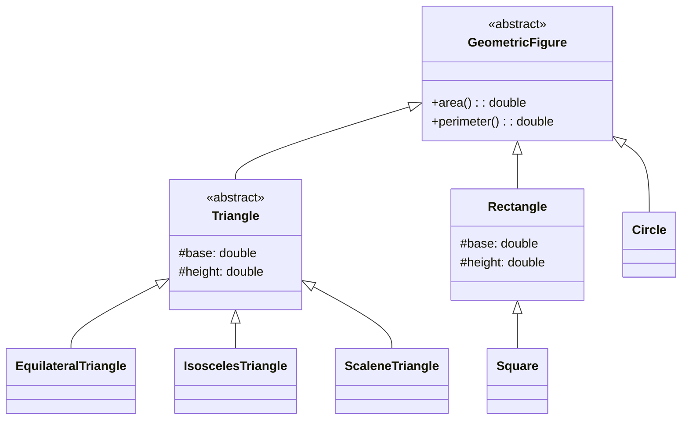
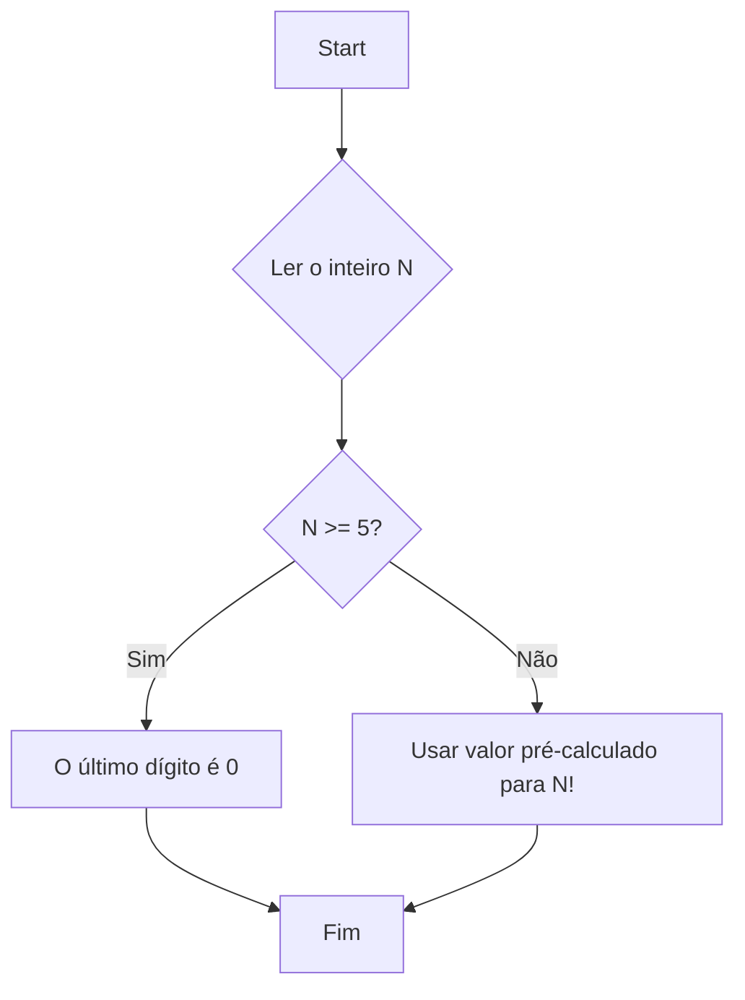
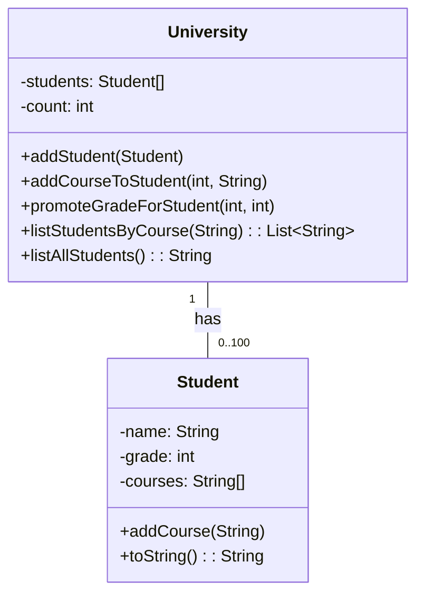

# Laboratório 1: Katas de Java

Este é um guia para o primeiro laboratório. Aqui, vamos resolver quatro pequenos desafios de programação (katas) que abordarão diferentes conceitos básicos de Java.

A ideia é que você entenda o problema, a lógica por trás da solução e como o código foi estruturado. Vamos começar!

---

## Kata 1: Figuras Geométricas

Neste kata, nosso objetivo é modelar diferentes figuras geométricas usando os conceitos de classes, herança e polimorfismo em Java.

### O Desafio

Precisamos criar um sistema que possa representar várias figuras geométricas, como triângulos (equilátero, isósceles, escaleno), retângulos, quadrados e círculos. Para cada figura, devemos ser capazes de calcular sua área e perímetro.

### Estrutura do Código

A solução está no arquivo `GeometricFigures.java`. A estrutura de classes e herança pode ser visualizada no diagrama abaixo:



A organização do código é a seguinte:

1.  **`GeometricFigure` (Classe Abstrata):**
    *   Esta é a nossa classe base. Ela define um "contrato" que todas as outras figuras devem seguir.
    *   Possui dois métodos abstratos: `area()` e `perimeter()`. Métodos abstratos não têm implementação; eles apenas forçam as subclasses a implementá-los.
    *   Isso garante que qualquer `GeometricFigure` terá uma maneira de calcular a área e o perímetro.

2.  **`Triangle`, `Rectangle` (Classes Abstratas e Concretas):**
    *   `Triangle` herda de `GeometricFigure` e também é abstrata. Ela adiciona as propriedades `base` e `height`, que são comuns a alguns tipos de triângulos.
    *   `Rectangle` também herda de `GeometricFigure` e é uma classe concreta, o que significa que podemos criar objetos a partir dela.

3.  **Classes de Figuras Específicas:**
    *   **`EquilateralTriangle`, `IsoscelesTriangle`, `ScaleneTriangle`:** Herdam de `Triangle` e fornecem implementações específicas para os cálculos de área e perímetro.
    *   **`Square`:** Herda de `Rectangle`, reutilizando a lógica de `base` e `height` (onde `base == height`).
    *   **`Circle`:** Herda diretamente de `GeometricFigure`.

4.  **`main` (Método Principal):**
    *   O método `main` na classe `GeometricFigures` é onde testamos nosso código. Criamos instâncias de cada figura e imprimimos suas propriedades.

### Como Executar

Para ver o código em ação, compile e execute o arquivo `GeometricFigures.java`. O resultado mostrará a área e o perímetro de cada uma das figuras que instanciamos no método `main`.

---

## Kata 2: Último Dígito do Fatorial

Este kata é um exercício de lógica e otimização.

### O Desafio

Dado um número inteiro `N`, precisamos encontrar o último dígito do seu fatorial (`N!`). O fatorial de um número é o produto de todos os inteiros positivos até esse número (ex: `5! = 5 * 4 * 3 * 2 * 1 = 120`).

### Lógica da Solução

A solução está no arquivo `LastDigitFactorial.java`. A abordagem ingênua seria calcular o fatorial completo e depois pegar o último dígito. No entanto, os fatoriais crescem muito rapidamente e podem exceder a capacidade dos tipos de dados padrão.

A solução inteligente (e a que usamos aqui) é observar um padrão, como mostra o fluxograma:



O padrão é o seguinte:
*   `0! = 1`
*   `1! = 1`
*   `2! = 2`
*   `3! = 6`
*   `4! = 24` (último dígito é 4)
*   `5! = 120` (último dígito é 0)
*   `6! = 720` (último dígito é 0)

Para qualquer `N >= 5`, o fatorial de `N` sempre terminará em 0, porque `N!` conterá os fatores 2 e 5, que resultam em 10.

### Como Executar

Execute o arquivo `LastDigitFactorial.java`. O programa solicitará o número de casos de teste e, em seguida, os números para os quais você deseja encontrar o último dígito do fatorial.

---

## Kata 3: Seleção de Quadrante

Um exercício simples para praticar condicionais.

### O Desafio

Dado um ponto com coordenadas `(x, y)`, determine em qual quadrante do plano cartesiano ele se encontra.

*   **Quadrante 1:** x > 0, y > 0
*   **Quadrante 2:** x < 0, y > 0
*   **Quadrante 3:** x < 0, y < 0
*   **Quadrante 4:** x > 0, y < 0

### Estrutura do Código

A solução está em `QuadrantSelection.java`. O código usa uma série de `if-else if` para verificar as condições de `x` e `y` e imprimir o quadrante correto, seguindo o fluxo abaixo (observe que a numeração dos quadrantes no código difere do padrão matemático).

```mermaid
graph TD
    A[Start] --> B{Ler x, y};
    B --> C{x > 0 e y > 0?};
    C -- Sim --> D[Imprimir "Quadrante 2"];
    C -- Não --> E{x < 0 e y > 0?};
    E -- Sim --> F[Imprimir "Quadrante 1"];
    E -- Não --> G{x < 0 e y < 0?};
    G -- Sim --> H[Imprimir "Quadrante 3"];
    G -- Não --> I[Imprimir "Quadrante 4"];
    D --> J[Fim];
    F --> J[Fim];
    H --> J[Fim];
    I --> J[Fim];
```

### Como Executar

Execute `QuadrantSelection.java`. O programa pedirá as coordenadas `x` e `y` e informará o quadrante.

---

## Kata 4: Sistema Universitário

Este kata foca em composição e no gerenciamento de uma coleção de objetos.

### O Desafio

Precisamos criar um sistema simples para gerenciar estudantes e cursos em uma universidade. O sistema deve permitir:
*   Adicionar novos alunos.
*   Adicionar cursos a um aluno.
*   Atualizar a nota de um aluno.
*   Listar alunos por curso.
*   Listar todos os alunos.

### Estrutura do Código

A solução está em `UniversitySystem.java`. Ela é composta por duas classes principais, `University` e `Student`. A relação entre elas é de **composição**: a universidade "tem" alunos.



1.  **`Student` (Classe):**
    *   Representa um único aluno.
    *   Possui atributos como `name`, `grade` e um array de `courses`.
    *   Contém métodos para obter e definir esses atributos (`getters` e `setters`).

2.  **`University` (Classe):**
    *   Representa a universidade.
    *   Contém um array de objetos `Student`.
    *   Implementa os métodos para realizar as operações principais do sistema (adicionar aluno, adicionar curso, etc.).

### Como Executar

Execute `UniversitySystem.java`. O método `main` já contém um exemplo de como usar as classes `University` e `Student`, demonstrando as funcionalidades do sistema.

---

Espero que este guia tenha sido útil! Sinta-se à vontade para modificar o código, experimentar e ver o que acontece. A melhor maneira de aprender é praticando.
