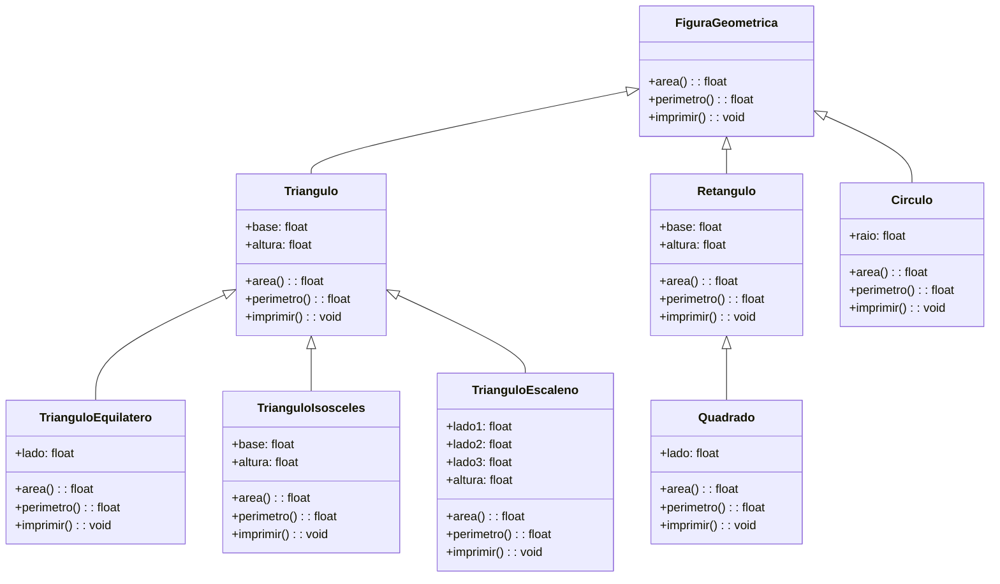

# Atividade #2 - OOP Introdução

#### Diagrama de Classes {id="diagrama-de-classes_1"}

```mermaid
classDiagram  
    %% Superclasse ou interface  
    class FiguraGeometrica {  
        +area(): float  
        +perimetro(): float  
        +imprimir(): void  
    }  
    
    %% Classes derivadas de FiguraGeometrica  
    class Triangulo {  
        +base: float  
        +altura: float  
        +area(): float  
        +perimetro(): float  
        +imprimir(): void  
    }  

    class Retangulo {  
        +base: float  
        +altura: float  
        +area(): float  
        +perimetro(): float  
        +imprimir(): void  
    }  

    class Circulo {  
        +raio: float  
        +area(): float  
        +perimetro(): float  
        +imprimir(): void  
    }  

    %% Classes derivadas de Triangulo  
    class TrianguloEquilatero {  
        +lado: float  
        +area(): float  
        +perimetro(): float  
        +imprimir(): void  
    }  

    class TrianguloIsosceles {  
        +base: float  
        +altura: float  
        +area(): float  
        +perimetro(): float  
        +imprimir(): void  
    }  

    class TrianguloEscaleno {  
        +lado1: float  
        +lado2: float  
        +lado3: float  
        +altura: float  
        +area(): float  
        +perimetro(): float  
        +imprimir(): void  
    }  

    class Quadrado {  
        +lado: float  
        +area(): float  
        +perimetro(): float  
        +imprimir(): void  
    }  

    %% Definindo as relações  
    FiguraGeometrica <|-- Triangulo  
    FiguraGeometrica <|-- Retangulo  
    FiguraGeometrica <|-- Circulo  
    Triangulo <|-- TrianguloEquilatero  
    Triangulo <|-- TrianguloIsosceles  
    Triangulo <|-- TrianguloEscaleno  
    Retangulo <|-- Quadrado
```

#### Execução {id="execu-o_2_1"}

