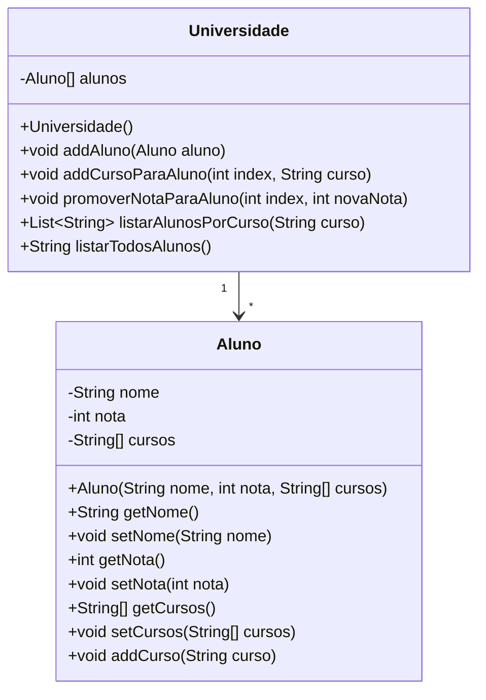

#  Atividade #3 - OOP Combinada com Matrizes Simples

#### Diagrama de Classes

```mermaid
classDiagram
    class Aluno {
        -String nome
        -int nota
        -String[] cursos
        +Aluno(String nome, int nota, String[] cursos)
        +String getNome()
        +void setNome(String nome)
        +int getNota()
        +void setNota(int nota)
        +String[] getCursos()
        +void setCursos(String[] cursos)
        +void addCurso(String curso)
    }

    class Universidade {
        -Aluno[] alunos
        +Universidade()
        +void addAluno(Aluno aluno)
        +void addCursoParaAluno(int index, String curso)
        +void promoverNotaParaAluno(int index, int novaNota)
        +List~String~ listarAlunosPorCurso(String curso)
        +String listarTodosAlunos()
    }

    Universidade "1" --> "*" Aluno
```

#### Execução {id="execu-o_2"}

