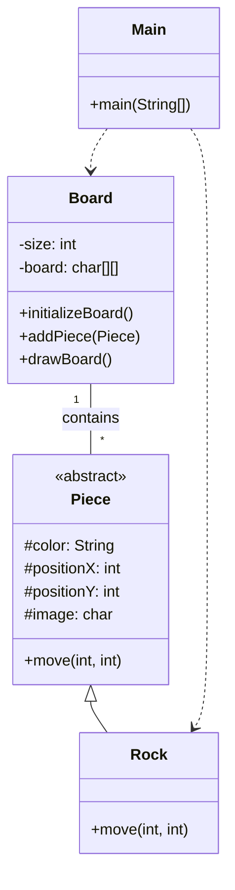

# Exercício: Xadrez com Torres (Rock Chess)

Este tutorial explica um pequeno projeto em Java que simula um tabuleiro de xadrez contendo apenas peças do tipo "Torre" (Rock). O objetivo é demonstrar conceitos de Programação Orientada a Objetos, como classes, herança e polimorfismo, em um cenário prático.

---

## O Desafio

O desafio consiste em criar um sistema que represente um tabuleiro de xadrez e permita a movimentação de torres. As regras são simples:

1.  O tabuleiro tem um tamanho definido (ex: 8x8).
2.  As torres podem ser de cores diferentes (ex: "red", "black").
3.  Uma torre só pode se mover na horizontal ou na vertical.
4.  Não é possível mover uma peça para uma casa já ocupada.
5.  Não é possível mover uma peça para fora do tabuleiro.

---

## Estrutura do Código

O projeto é dividido em quatro classes principais, cada uma com uma responsabilidade clara. A relação entre elas pode ser vista no diagrama abaixo:



### 1. `Piece.java` (Classe Abstrata)

*   **Responsabilidade:** É o "molde" para todas as peças do jogo. Define os atributos e comportamentos que toda peça deve ter.
*   **Atributos:**
    *   `color`: A cor da peça.
    *   `positionX`, `positionY`: As coordenadas da peça no tabuleiro.
    *   `image`: O caractere que representa a peça visualmente (ex: '♜').
*   **Métodos:**
    *   `move(int, int)`: Um método abstrato. Isso força que toda classe que herde de `Piece` (como a `Rock`) tenha que implementar sua própria lógica de movimento.

### 2. `Rock.java`

*   **Responsabilidade:** Representa a peça Torre.
*   **Herança:** Herda da classe `Piece`, recebendo todos os seus atributos.
*   **Métodos:**
    *   `move(int, int)`: Implementa a regra de movimento da torre. A lógica aqui é simples: o movimento só é válido se a nova posição `newPositionX` for diferente de `newPositionY`, o que não reflete a regra real do xadrez e parece ser um erro de lógica no código original. A validação correta seria verificar se `positionX == newPositionX` OU `positionY == newPositionY`.

### 3. `Board.java`

*   **Responsabilidade:** Representa o tabuleiro do jogo.
*   **Atributos:**
    *   `size`: O tamanho do tabuleiro (ex: 8 para um tabuleiro 8x8).
    *   `board`: Uma matriz de caracteres (`char[][]`) que armazena o estado do tabuleiro, guardando a `image` de cada peça em sua respectiva coordenada.
*   **Métodos:**
    *   `initializeBoard()`: Preenche o tabuleiro com espaços em branco, limpando-o.
    *   `addPiece(Piece)`: Adiciona uma peça ao tabuleiro em sua posição. Lança uma exceção se a posição for inválida ou já estiver ocupada.
    *   `drawBoard()`: Imprime o estado atual do tabuleiro no console.

### 4. `Main.java`

*   **Responsabilidade:** É o ponto de entrada do programa. Orquestra a criação do tabuleiro e das peças e simula um jogo.
*   **Lógica:**
    1.  Cria um `Board`.
    2.  Cria duas peças `Rock`.
    3.  Inicializa e desenha o tabuleiro vazio.
    4.  Adiciona as peças ao tabuleiro e o desenha novamente.
    5.  Simula o movimento das peças.
    6.  Atualiza o tabuleiro com as novas posições e o desenha pela última vez.

---

## Como Executar

Para rodar o projeto, compile e execute a classe `Main.java`. O console mostrará o tabuleiro em três momentos:

1.  Inicialmente vazio.
2.  Com as torres em suas posições iniciais.
3.  Com as torres em suas posições finais, após o movimento.

---

## Pontos de Melhoria

O código é um bom ponto de partida, mas a lógica de movimento da torre em `Rock.java` está incorreta. Um bom exercício seria corrigi-la para que a torre se mova apenas na vertical ou horizontal. A validação correta seria:

```java
if (newPositionX == this.positionX || newPositionY == this.positionY) {
    this.positionX = newPositionX;
    this.positionY = newPositionY;
} else {
    throw new IllegalArgumentException("A Torre só pode se mover na horizontal ou na vertical.");
}
```

Sinta-se à vontade para aplicar essa correção e testar o resultado!