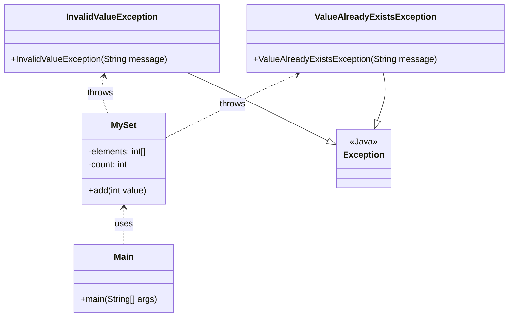
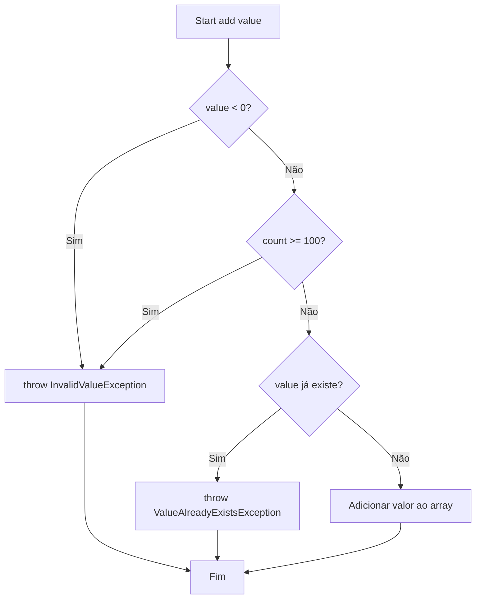

# Exercício: Tratamento de Exceções Customizadas

Este tutorial demonstra como criar e utilizar exceções personalizadas em Java para gerenciar erros de forma mais específica e semântica. O exemplo prático é a implementação de uma classe `MySet`, que simula um conjunto com regras de validação próprias.

---

## O Desafio

O objetivo é construir uma classe `MySet` que armazena números inteiros, mas com as seguintes regras:

1.  Não permite a adição de valores duplicados.
2.  Não permite a adição de valores negativos.
3.  Tem um limite máximo de 100 elementos.

Para cada uma dessas regras, se uma violação ocorrer, o sistema deve lançar uma exceção customizada e específica, em vez de uma exceção genérica do Java.

---

## Estrutura do Código

O projeto é composto por quatro classes principais que trabalham em conjunto para criar um sistema robusto de tratamento de erros.

### 1. `InvalidValueException.java` e `ValueAlreadyExistsException.java`

*   **Responsabilidade:** São as nossas exceções customizadas. Elas herdam da classe `Exception` do Java, o que permite que sejam usadas no mecanismo de `try-catch`.
*   Criar classes de exceção próprias torna o código mais legível, pois o nome da exceção já descreve o erro que ocorreu (ex: `ValueAlreadyExistsException` é muito mais claro que `IllegalArgumentException`).

### 2. `MySet.java`

*   **Responsabilidade:** Implementa a lógica do conjunto. É aqui que as regras de negócio são validadas.
*   O método `add(int value)` contém a lógica de validação. Ele segue o fluxo abaixo:

### 3. `Main.java`

*   **Responsabilidade:** É o ponto de entrada da aplicação e demonstra o uso seguro da classe `MySet`.
*   Ele utiliza um laço `while` para ler a entrada do usuário e um bloco `try-catch` para chamar o método `mySet.add()`. Se uma das exceções customizadas for lançada, o bloco `catch` correspondente a captura e exibe a mensagem de erro para o usuário de forma controlada, sem que o programa quebre.

---

## Conceitos Chave

*   **Exceções Customizadas:** Criar suas próprias classes de exceção herdando de `Exception` para representar erros específicos do seu domínio.
*   **`throw`:** Usado para lançar uma instância de uma exceção quando uma condição de erro é detectada.
*   **`throws`:** Usado na assinatura de um método para declarar que ele pode lançar certas exceções, obrigando quem o chama a lidar com elas.
*   **`try-catch`:** Mecanismo para capturar e tratar exceções, permitindo que o programa se recupere de erros e continue a execução.

---

## Como Executar

Compile e execute a classe `Main.java`. O programa solicitará que você insira números. Tente inserir um número negativo, um número repetido ou mais de 100 números para ver as mensagens de exceção em ação.
