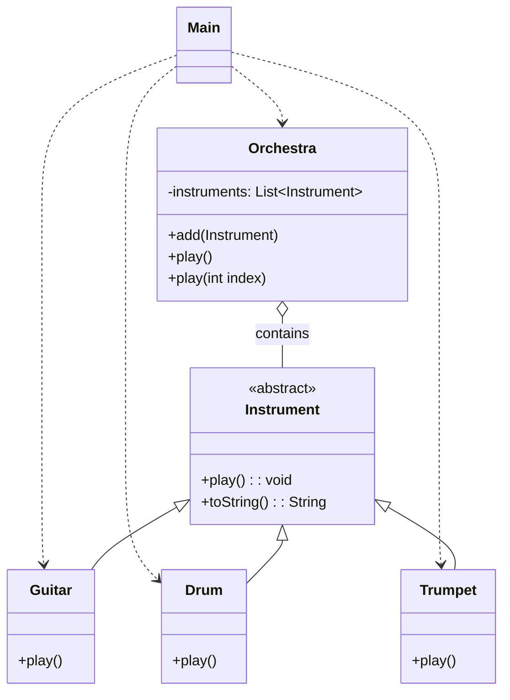

# Exercício: Polimorfismo com Instrumentos Musicais

Este projeto demonstra o conceito de Polimorfismo na Programação Orientada a Objetos usando uma analogia com uma orquestra e seus instrumentos musicais. O polimorfismo permite que objetos de diferentes classes respondam à mesma mensagem (chamada de método) de maneiras específicas para cada classe.

---

## O Desafio

O objetivo é modelar um sistema que represente uma orquestra. A orquestra deve ser capaz de conter diferentes tipos de instrumentos (como guitarra, bateria e trompete). O sistema deve permitir:

1.  Adicionar qualquer tipo de instrumento à orquestra.
2.  Tocar todos os instrumentos da orquestra juntos, cada um produzindo seu som característico.
3.  Tocar um instrumento específico da orquestra.

---

## Estrutura do Código

O projeto utiliza herança e classes abstratas para criar uma estrutura flexível e polimórfica.

### 1. `Instrument.java` (Classe Abstrata)

*   **Responsabilidade:** Serve como um "contrato" genérico para todos os instrumentos. Define o que significa ser um instrumento no nosso sistema.
*   Declara o método `play()` como `abstract`, forçando cada subclasse a fornecer sua própria implementação. Isso garante que todo objeto do tipo `Instrument` saberá como "tocar".

### 2. `Guitar.java`, `Drum.java`, `Trumpet.java`

*   **Responsabilidade:** São as implementações concretas dos instrumentos.
*   Cada uma herda de `Instrument` e sobrescreve (`@Override`) o método `play()` para imprimir o som característico daquele instrumento (ex: "Guitar: strums").

### 3. `Orchestra.java`

*   **Responsabilidade:** Gerencia a coleção de instrumentos e orquestra a execução.
*   **O Ponto Chave do Polimorfismo:** A orquestra possui uma `List<Instrument>`. Ela não precisa saber se os objetos na lista são `Guitar`, `Drum` ou `Trumpet`. Ela simplesmente os trata como `Instrument`.
*   Quando o método `orchestra.play()` itera sobre a lista e chama `instrument.play()`, o Java Virtual Machine (JVM) se encarrega de executar a versão correta do método `play()` para cada objeto. Se o objeto é uma `Guitar`, o `play()` da guitarra é chamado; se é um `Drum`, o `play()` da bateria é chamado. Isso é polimorfismo em ação.

### 4. `Main.java`

*   **Responsabilidade:** Ponto de entrada da aplicação. Cria as instâncias dos instrumentos e da orquestra para demonstrar o funcionamento do sistema.

---

## Como Executar

Compile e execute a classe `Main.java`. A saída no console mostrará a orquestra tocando todos os instrumentos juntos e, em seguida, tocando apenas a guitarra.

---

## Conceitos Chave

*   **Polimorfismo (de Subtipo):** A capacidade de um objeto assumir muitas formas. No nosso caso, a `Orchestra` trata todos os objetos através da interface comum da superclasse `Instrument`, e o comportamento específico é determinado em tempo de execução.
*   **Classes Abstratas:** Usadas para criar uma classe base que não pode ser instanciada, mas que define uma estrutura comum para suas subclasses.
*   **Herança:** Permite que as classes de instrumentos concretos herdem os traços da classe `Instrument`.
