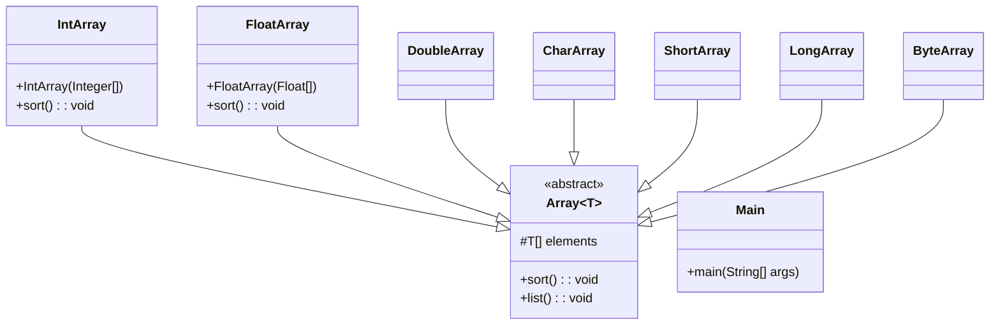

# Exercício: Classificação de Polimorfismo com Arrays Genéricos

Este projeto explora diferentes tipos de polimorfismo em Java, especificamente o **Polimorfismo Paramétrico (Generics)** e o **Polimorfismo de Subtipo (Sobrescrita)**. O objetivo é criar uma hierarquia de classes para encapsular e ordenar arrays de diferentes tipos de dados.

---

## O Desafio

O desafio é criar um sistema de classes que possa:

1.  Representar um array de forma genérica, ou seja, que funcione para múltiplos tipos de dados (Inteiros, Floats, Caracteres, etc.).
2.  Fornecer um método para ordenar os elementos do array.
3.  Permitir que cada tipo de array (se necessário) possa ter sua própria implementação de ordenação.

---

## Estrutura do Código

O projeto utiliza uma classe base abstrata e genérica para definir o comportamento comum e classes concretas para implementar a funcionalidade específica para cada tipo de dado.

### 1. `Array.java` (Classe Abstrata e Genérica)

*   **Responsabilidade:** É a classe base que define a estrutura para todos os nossos arrays customizados.
*   **Polimorfismo Paramétrico (Generics):** A declaração `class Array<T extends Comparable<T>>` é o ponto central aqui. 
    *   `T` é um parâmetro de tipo, o que torna a classe genérica. Ela pode funcionar com qualquer tipo `T`.
    *   `extends Comparable<T>` é um "limite superior". Isso garante que qualquer tipo `T` usado com esta classe deve implementar a interface `Comparable`, o que significa que seus objetos sabem como ser comparados (essencial para a ordenação).
*   Possui um método `list()` concreto e um método `sort()` abstrato, forçando as subclasses a implementarem sua própria lógica de ordenação.

### 2. `IntArray`, `FloatArray`, etc. (Classes Concretas)

*   **Responsabilidade:** São as implementações específicas da classe `Array` para cada tipo de dado.
*   **Polimorfismo de Subtipo (Sobrescrita):** Cada uma dessas classes herda de `Array` e fornece uma implementação concreta para o método `sort()`. No código, todas as classes usam `Arrays.sort()` para ordenar os elementos em ordem decrescente. Embora a implementação seja a mesma em todos, a estrutura permite que cada uma pudesse ter uma lógica diferente se necessário.

### 3. `Main.java`

*   **Responsabilidade:** Demonstra o uso das classes de array. Cria instâncias de `IntArray`, `FloatArray`, etc., chama o método `sort()` de cada uma e depois o método `list()` para exibir o resultado ordenado.

---

## Como Executar

Compile e execute a classe `Main.java`. A saída no console mostrará os diferentes arrays (de inteiros, floats, etc.) ordenados em ordem decrescente.

---

## Conceitos Chave

*   **Polimorfismo Paramétrico (Generics):** Permite escrever classes e métodos que operam sobre tipos. Isso aumenta a reutilização de código e a segurança de tipo. A classe `Array<T>` é um exemplo perfeito.
*   **Polimorfismo de Subtipo (Sobrescrita):** Ocorre quando uma subclasse fornece uma implementação específica para um método que já é definido em sua superclasse. Aqui, `IntArray` sobrescreve o método `sort()` de `Array`.
*   **Interfaces (Comparable):** Usada para definir um contrato de comparabilidade, essencial para algoritmos de ordenação.
