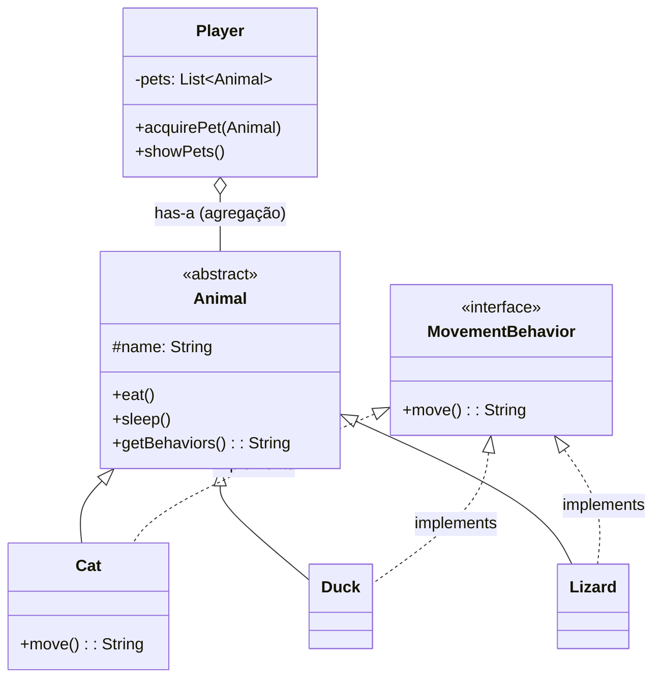

# Exercício: Relações entre Classes (Associação, Agregação e Composição)

Este projeto foi desenhado para ilustrar as diferentes maneiras como as classes podem se relacionar em Programação Orientada a Objetos. Usando uma analogia de um jogador e seus animais de estimação, exploramos Herança, Implementação de Interfaces e, mais importante, a relação de **Agregação**.

---

## O Desafio

O objetivo é modelar um sistema simples onde:

1.  Existem diferentes tipos de `Animal` (Gato, Pato, Lagarto, etc.).
2.  Cada animal tem comportamentos básicos (comer, dormir) e comportamentos de movimento (andar, voar, nadar).
3.  Um `Player` pode adquirir e ter uma coleção de animais de estimação.

O foco principal é entender e implementar corretamente a relação entre o `Player` e seus `Animal`s.

---

## Estrutura e Relações do Código

O diagrama de classes abaixo mostra as principais entidades e como elas se conectam.

### 1. Herança (`extends`)

*   As classes `Cat`, `Duck`, `Lizard`, etc., **herdam** da classe abstrata `Animal`.
*   Isso significa que um `Cat` **é um** `Animal`. A herança cria uma relação "é um" e permite que as subclasses reutilizem o código e a estrutura da superclasse.

### 2. Implementação de Interface (`implements`)

*   As classes de animais concretos **implementam** a interface `MovementBehavior`.
*   Uma interface define um "contrato" de comportamento. Qualquer classe que implementa `MovementBehavior` **deve** fornecer uma implementação para o método `move()`. Isso garante que todos os nossos animais tenham a capacidade de se mover.

### 3. Agregação (Relação "tem um")

*   Esta é a relação mais importante demonstrada neste projeto.
*   A classe `Player` possui uma `List<Animal>`. Isso significa que um `Player` **tem um** ou mais `Animal`s.
*   **Por que é Agregação e não Composição?** O ciclo de vida dos objetos `Animal` não depende do ciclo de vida do objeto `Player`. No `Main.java`, os animais são criados primeiro, de forma independente. Depois, eles são "adquiridos" pelo jogador (passados como parâmetro para `acquirePet`). Se o objeto `player` fosse destruído, os objetos `m1`, `m2`, etc., ainda existiriam. Em uma relação de agregação, os objetos podem existir de forma independente.

---

## Como Executar

Compile e execute a classe `Main.java`. A saída mostrará o jogador adquirindo animais e, em seguida, listando os comportamentos de todos os animais, tanto os que ele possui quanto os que existem independentemente no "mundo" do programa.

---

## Conceitos Chave

*   **Associação:** A relação mais genérica entre duas classes. Agregação e Composição são tipos específicos de Associação.
*   **Agregação:** Uma relação "tem um" onde as classes são independentes. A classe "container" (Player) não controla o ciclo de vida da classe "contida" (Animal).
*   **Composição:** Uma forma mais forte de agregação, onde o ciclo de vida da classe "contida" é gerenciado pela classe "container". Se o `Player` criasse os `Animal`s dentro de si mesmo (`new Cat()`), seria composição.
