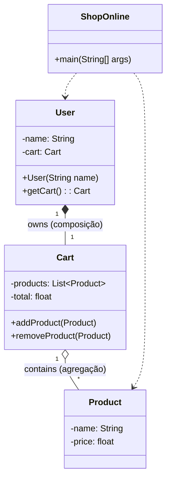

# Exercício: Loja Online (Demonstração de Composição)

Este projeto simula um sistema de loja online via linha de comando. Seu principal objetivo é demonstrar a relação de **Composição**, um dos conceitos fundamentais de design em Programação Orientada a Objetos, além de ilustrar a Agregação.

---

## O Desafio

O desafio é criar um sistema interativo onde um usuário pode:

1.  Adicionar e remover produtos de um carrinho de compras.
2.  Visualizar os produtos no carrinho e o custo total.
3.  Aplicar um desconto ao total da compra.
4.  Limpar o carrinho.

O foco é modelar corretamente a relação entre o `User`, seu `Cart` (carrinho) e os `Product`s.

---

## Estrutura e Relações do Código

O projeto é estruturado em torno de três classes de dados/modelo (`Product`, `Cart`, `User`) e uma classe principal que controla a execução (`ShopOnline`).

### Relações Chave

#### 1. Composição (`User` e `Cart`)

*   A relação entre `User` e `Cart` é de **Composição**. Esta é uma relação forte do tipo "parte-de".
*   **Evidência no Código:** Dentro do construtor da classe `User`, a linha `this.cart = new Cart();` cria uma nova instância de `Cart`. 
*   **O que isso significa?** O objeto `Cart` é criado e gerenciado **pelo** objeto `User`. O carrinho não pode existir sem um usuário. Se o objeto `User` for destruído (por exemplo, pelo Garbage Collector do Java), seu objeto `Cart` associado também será, pois nenhuma outra parte do programa tem uma referência a ele. O ciclo de vida do `Cart` está atrelado ao do `User`.
*   No diagrama, a composição é representada por um losango preenchido (`*--`).

#### 2. Agregação (`Cart` e `Product`)

*   A relação entre `Cart` e `Product` é de **Agregação**. Esta é uma relação "tem-um" mais fraca.
*   **Evidência no Código:** Os objetos `Product` são criados na classe `ShopOnline`, de forma independente. Eles são então passados como parâmetro para o método `cart.addProduct(product)`. 
*   **O que isso significa?** O `Cart` apenas "guarda uma referência" para os produtos. Os produtos existem independentemente do carrinho. Se o carrinho for limpo (`clearCart()`) ou destruído, os objetos `Product` originais ainda existem e podem ser adicionados a outros carrinhos.
*   No diagrama, a agregação é representada por um losango vazio (`o--`).

---

## Como Executar

Compile e execute a classe `ShopOnline.java`. Um menu interativo aparecerá no console, permitindo que você simule as ações de um cliente em uma loja online.

---

## Conceitos Chave

*   **Composição:** Uma relação forte "parte-de" onde o ciclo de vida do objeto "parte" (`Cart`) é controlado pelo objeto "todo" (`User`).
*   **Agregação:** Uma relação "tem-um" onde o objeto "container" (`Cart`) não controla o ciclo de vida dos objetos contidos (`Product`).
*   **Encapsulamento:** As classes `User`, `Cart` e `Product` encapsulam seus próprios dados e lógicas, expondo apenas os métodos necessários para interagir com elas.