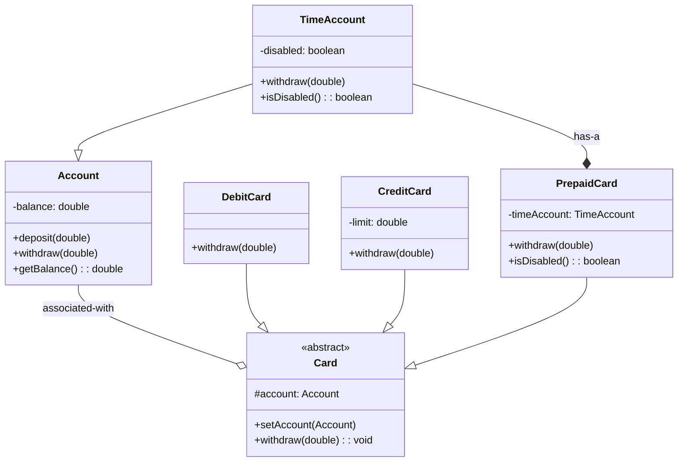

# Exercício: Classes Abstratas em um Sistema Bancário

Este projeto demonstra o uso de classes e métodos abstratos para modelar um sistema com diferentes tipos de cartões bancários. O objetivo é criar uma estrutura base que defina comportamentos comuns, ao mesmo tempo que permite que cada tipo de cartão (crédito, débito, pré-pago) tenha sua própria lógica de saque.

---

## O Desafio

O desafio é construir um sistema que represente os seguintes componentes:

1.  Uma `Account` (Conta) com um saldo.
2.  Um `Card` (Cartão) genérico que está associado a uma conta.
3.  Tipos específicos de cartões:
    *   `DebitCard`: Saca diretamente do saldo da conta.
    *   `CreditCard`: Saca utilizando um limite de crédito, além do saldo da conta.
    *   `PrepaidCard`: Funciona com base em uma conta com saldo próprio que, ao chegar a zero, desativa o cartão.

O ponto central é usar uma classe abstrata `Card` para garantir que todos os tipos de cartão tenham um método `withdraw`, mas cada um com sua regra de negócio.

---

## Estrutura do Código

O projeto utiliza herança e classes abstratas para criar uma hierarquia clara e funcional.

### 1. `Account.java` e `TimeAccount.java`
*   `Account` é uma classe concreta que gerencia um saldo. 
*   `TimeAccount` herda de `Account` e adiciona uma lógica para ser desativada (`disabled`) quando o saldo chega a zero.

### 2. `Card.java` (Classe Abstrata)
*   **Responsabilidade:** É o "molde" para todos os cartões. Define que todo cartão deve estar associado a uma `Account`.
*   Declara o método `withdraw(double amount)` como `abstract`. Isso significa que a classe `Card` não sabe como um saque é feito, mas obriga todas as suas subclasses a fornecerem uma implementação concreta para esse método.

### 3. `DebitCard`, `CreditCard`, `PrepaidCard` (Classes Concretas)
*   **Responsabilidade:** São as implementações específicas dos cartões.
*   Cada uma herda de `Card` e **sobrescreve** o método `withdraw` com sua lógica particular:
    *   `DebitCard`: Chama diretamente o `withdraw` da conta associada.
    *   `CreditCard`: Verifica o limite antes de efetuar o saque.
    *   `PrepaidCard`: Utiliza a `TimeAccount` interna para o saque.

### 4. `Main.java`
*   Ponto de entrada da aplicação. Cria instâncias de contas e cartões para testar e demonstrar as diferentes lógicas de saque.

---

## Conceitos Chave

*   **Classe Abstrata:** Uma classe que não pode ser instanciada e serve como base para outras classes. É ideal para definir um modelo comum.
*   **Método Abstrato:** Um método declarado sem implementação em uma classe abstrata. Força as subclasses a criarem sua própria versão do método.
*   **Polimorfismo:** Embora todos os cartões sejam tratados como `Card`, a chamada ao método `withdraw` executa a implementação específica da subclasse correspondente.

---

## Como Executar

Compile e execute a classe `Main.java`. A saída no console mostrará os saldos das contas após as operações de saque com os diferentes tipos de cartão, demonstrando as regras de cada um.