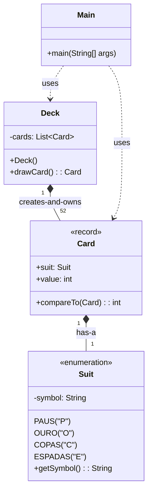

# Exercício: Usando Enums e Records para um Jogo de Cartas

Este projeto demonstra o uso de `enum` para representar um conjunto fixo de constantes (os naipes de um baralho) e `record` para criar classes de dados imutáveis (as cartas). Juntos, eles criam uma base de código limpa, segura e expressiva para um simples jogo de cartas.

---

## O Desafio

O objetivo é modelar um baralho de cartas e um jogo simples de "maior carta vence". O sistema deve:

1.  Representar os quatro naipes do baralho (Paus, Ouro, Copas, Espadas) de forma segura.
2.  Representar uma carta, que tem um naipe e um valor.
3.  Criar um baralho (`Deck`) com todas as 52 cartas.
4.  Embaralhar o baralho e permitir que cartas sejam sacadas.
5.  Comparar duas cartas para ver qual tem o maior valor.

---

## Estrutura do Código

O projeto é conciso e utiliza recursos modernos do Java para modelar os dados de forma eficiente.

### 1. `Suit.java` (Enum)
*   **Responsabilidade:** Representar o conjunto fixo e limitado de naipes de um baralho.
*   **Por que usar `enum`?** Garante a segurança de tipos. É impossível criar um naipe que não seja um dos quatro definidos. Isso evita erros com strings (ex: "Paus" vs "paus").
*   **Enum com Atributos:** O `Suit` também possui um atributo `symbol` e um método `getSymbol()`, mostrando como enums podem ter comportamentos e estados, assim como classes.

### 2. `Card.java` (Record)
*   **Responsabilidade:** Representar uma única carta do baralho.
*   **Por que usar `record`?** Uma carta, uma vez criada, não deve mudar (é imutável). `record` é um atalho para criar classes imutáveis. O compilador gera automaticamente o construtor, os getters, `equals()`, `hashCode()` e `toString()`.
*   Implementa a interface `Comparable<Card>` para definir uma ordem natural para as cartas (baseada no valor), permitindo que sejam facilmente comparadas.

### 3. `Deck.java`
*   **Responsabilidade:** Gerencia a coleção de 52 cartas.
*   No construtor, ele itera sobre os valores do enum `Suit` e os valores de 1 a 13 para criar o baralho completo. Em seguida, utiliza `Collections.shuffle()` para embaralhar as cartas.

### 4. `Main.java`
*   Ponto de entrada da aplicação. Simula o jogo: cria um baralho, saca uma carta para o computador e uma para o jogador, e as compara para determinar o vencedor.

---

## Conceitos Chave

*   **Enum:** Um tipo de dado especial que permite a uma variável ser um de um conjunto de constantes pré-definidas. Ideal para representar estados, tipos, categorias, etc.
*   **Record:** Uma forma concisa de criar classes que são simples contêineres de dados imutáveis. Reduz drasticamente o código boilerplate.
*   **Imutabilidade:** A prática de criar objetos cujo estado não pode ser modificado após a criação. Leva a um código mais simples e seguro, especialmente em programação concorrente.
*   **`Comparable` Interface:** Define um método (`compareTo`) para especificar a ordem natural de objetos de uma classe.

---

## Como Executar

Compile e execute a classe `Main.java`. A saída mostrará as cartas sacadas pelo computador e pelo jogador, e o resultado do jogo (quem ganhou, perdeu ou se houve empate).
