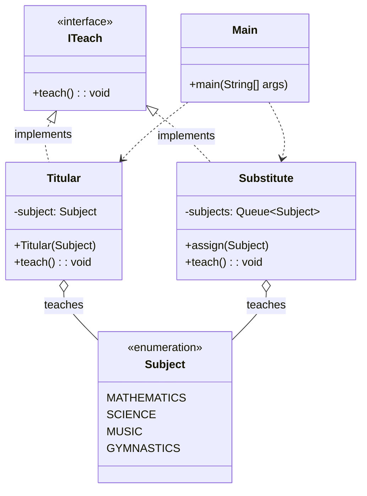

# Exercício: Simulando Herança Múltipla com Interfaces

O Java, por design, não permite que uma classe herde de múltiplas superclasses (o "problema do diamante"). No entanto, é possível que uma classe implemente múltiplas interfaces. Este projeto demonstra como usar interfaces para alcançar um resultado semelhante à herança múltipla: compartilhar um comportamento comum entre classes não relacionadas.

---

## O Desafio

O objetivo é modelar um sistema de professores com dois tipos:

1.  `Titular`: Um professor efetivo que leciona sempre a mesma matéria.
2.  `Substitute`: Um professor substituto que pode lecionar diferentes matérias, uma de cada vez, a partir de uma fila de atribuições.

Ambos os tipos de professor devem ter a capacidade de "ensinar" (`teach`). O desafio é implementar essa capacidade comum (`teach`) em ambas as classes, mesmo que suas lógicas internas sejam completamente diferentes.

---

## Estrutura do Código

O projeto utiliza uma interface para definir o contrato de comportamento e duas classes concretas que o implementam.

### 1. `ITeach.java` (Interface)
*   **Responsabilidade:** Define o contrato, ou a "habilidade", de ensinar. 
*   Declara um único método, `teach()`, sem implementação. Qualquer classe que queira ser "ensinável" (`teachable`) **deve** implementar esta interface e fornecer uma lógica para o método `teach()`.

### 2. `Titular.java`
*   **Responsabilidade:** Representa o professor titular.
*   Implementa a interface `ITeach`. Sua versão do método `teach()` simplesmente imprime a matéria fixa que lhe foi atribuída no construtor.

### 3. `Substitute.java`
*   **Responsabilidade:** Representa o professor substituto.
*   Também implementa a interface `ITeach`.
*   Sua lógica é mais complexa: ele mantém uma `Queue` (fila) de matérias. Cada vez que o método `teach()` é chamado, ele remove a próxima matéria da fila e a "leciona".

### 4. `Subject.java` (Enum)
*   Um `enum` simples para representar as matérias disponíveis de forma segura e legível.

### 5. `Main.java`
*   Ponto de entrada da aplicação. Cria instâncias de `Titular` e `Substitute`, demonstra como eles são configurados de maneiras diferentes, mas como ambos podem responder à mesma chamada de método `teach()`.

---

## Conceitos Chave

*   **Interface:** Um tipo de referência em Java, semelhante a uma classe, que pode conter apenas constantes, assinaturas de métodos, métodos padrão, métodos estáticos e tipos aninhados. Não pode conter construtores ou campos de instância.
*   **"Herança Múltipla" de Comportamento:** Ao fazer com que várias classes implementem a mesma interface, elas passam a compartilhar um tipo comum e um conjunto de comportamentos, mesmo que não tenham uma relação de herança direta. Um método poderia, por exemplo, aceitar qualquer objeto do tipo `ITeach`, seja ele `Titular` ou `Substitute`.
*   **Polimorfismo:** O mesmo método `teach()` pode ser chamado em objetos de tipos diferentes (`Titular`, `Substitute`), e cada um executará sua própria implementação específica.

---

## Como Executar

Compile e execute a classe `Main.java`. A saída no console mostrará o professor titular lecionando sua matéria e o professor substituto lecionando as matérias da sua fila, uma por vez.