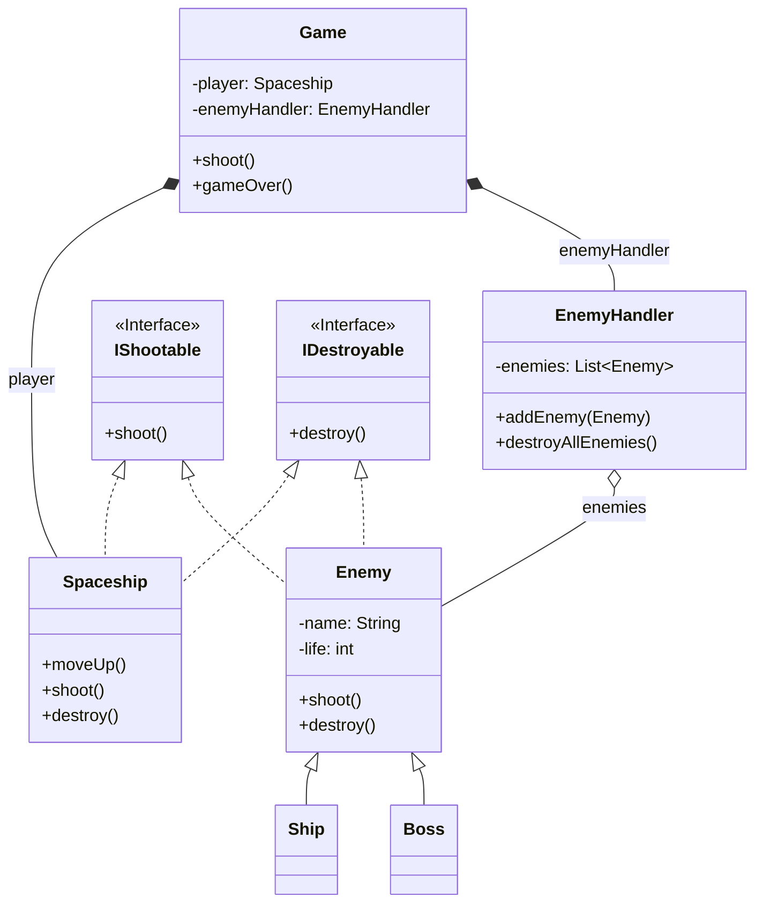

# Exercício: Estruturando um Jogo com Interfaces e Composição

Este projeto esboça a arquitetura de um simples jogo de nave espacial. O objetivo principal é demonstrar como **Interfaces** podem ser usadas para definir "habilidades" ou "comportamentos" (como atirar ou ser destrutível) e como a **Composição** pode ser usada para construir objetos complexos a partir de partes mais simples.

---

## O Desafio

O desafio é projetar a estrutura de um jogo que contém:

1.  Uma `Spaceship` (nave do jogador) que pode se mover, atirar e ser destruída.
2.  Diferentes tipos de `Enemy` (inimigos), como `Ship` e `Boss`, que também podem atirar e ser destruídos.
3.  Um `Game` que atua como o controlador principal, gerenciando o jogador e os inimigos.
4.  Um `EnemyHandler` para gerenciar a coleção de inimigos ativos.

O foco não está na lógica completa do jogo, mas em como as classes e interfaces se relacionam para criar um design flexível e extensível.

---

## Estrutura do Código

O design depende fortemente de interfaces para definir capacidades e de classes que compõem outras para construir a lógica do jogo.



### 1. `IShootable` e `IDestroyable` (Interfaces)
*   **Responsabilidade:** Definem contratos para comportamentos. 
    *   `IShootable` garante que qualquer classe que a implemente terá um método `shoot()`.
    *   `IDestroyable` garante que qualquer classe que a implemente terá um método `destroy()`.
*   **Vantagem:** Isso desacopla a habilidade da hierarquia de classes. Um objeto não precisa ser um `Enemy` para ser destrutível. Um `Obstacle` (obstáculo) também poderia implementar `IDestroyable`.

### 2. `Spaceship` e `Enemy`
*   Ambas as classes (ou, no caso do `Enemy`, sua hierarquia) implementam as interfaces `IShootable` e `IDestroyable`. Isso permite que diferentes objetos do jogo compartilhem comportamentos comuns, mesmo sendo fundamentalmente diferentes.

### 3. `EnemyHandler` e `Game` (Composição e Agregação)
*   `EnemyHandler` **tem uma** lista de `Enemy` (Agregação), gerenciando-os.
*   `Game` **tem um** `Spaceship` e **tem um** `EnemyHandler` (Composição). A classe `Game` é o objeto "todo" que é construído a partir de "partes" menores e mais especializadas. Ela orquestra as interações entre o jogador e os inimigos.

### 4. `Main.java`
*   Serve como um script para simular uma sequência de eventos no jogo, como adicionar inimigos, mover o jogador, atirar e terminar o jogo.

---

## Pontos de Melhoria (Bugs no Código Original)

O código fornecido tem uma falha crítica que impede sua execução:

*   **`NullPointerException`:** No construtor da classe `Game`, a variável `enemyHandler` é declarada, mas nunca é inicializada com `new EnemyHandler()`. 
*   **Consequência:** Qualquer chamada a um método que use `enemyHandler` (como `game.addEnemy()`) resultará em um `NullPointerException`.
*   **Correção:** Adicione `this.enemyHandler = new EnemyHandler();` ao construtor da classe `Game`.

```java
// Em Game.java
public Game() {
    player = new Spaceship("mark 1", "blue");
    this.enemyHandler = new EnemyHandler(); // Linha que falta
}
```

---

## Como Executar

Após aplicar a correção mencionada acima, compile e execute a classe `Main.java`. A saída no console mostrará a sequência de ações do jogo, como o jogador atirando e os inimigos sendo destruídos.
