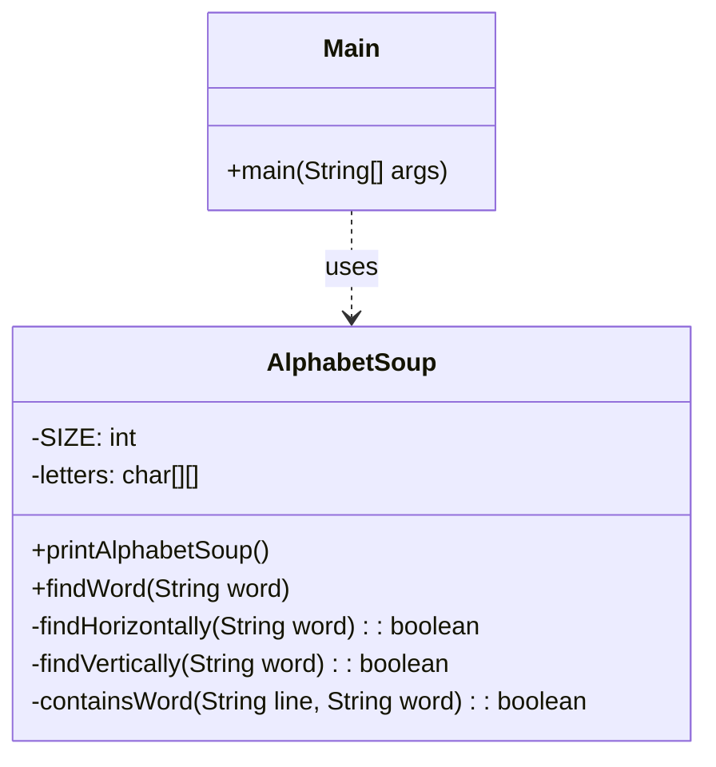

# Exercício: Caça-Palavras (Alphabet Soup)

Este projeto implementa um jogo de caça-palavras simples em Java. O objetivo é encontrar uma palavra em um tabuleiro de letras pré-definido, procurando na horizontal e na vertical, tanto na ordem normal quanto na invertida.

---

## O Desafio

O desafio consiste em:

1.  Representar um tabuleiro de caça-palavras (uma matriz de caracteres).
2.  Criar uma função que receba uma palavra do usuário.
3.  Verificar se a palavra existe no tabuleiro em uma das quatro direções:
    *   Horizontal, da esquerda para a direita.
    *   Horizontal, da direita para a esquerda (invertida).
    *   Vertical, de cima para baixo.
    *   Vertical, de baixo para cima (invertida).
4.  Informar ao usuário se a palavra foi encontrada e em qual orientação (horizontal ou vertical).

---

## Estrutura do Código

O projeto é composto por duas classes principais, cada uma com uma responsabilidade bem definida.

### 1. `AlphabetSoup.java`

*   **Responsabilidade:** Contém toda a lógica do jogo. Gerencia o tabuleiro e os métodos de busca.
*   **Atributos:**
    *   `letters`: Uma matriz `char[][]` que armazena o tabuleiro do caça-palavras.
*   **Métodos Principais:**
    *   `findWord(String word)`: O método público principal. Ele orquestra a busca, chamando os métodos de busca horizontal e vertical.
    *   `findHorizontally(String word)`: Itera sobre cada linha da matriz. Para cada linha, chama `containsWord()` para verificar a existência da palavra.
    *   `findVertically(String word)`: Itera sobre cada coluna. Ele constrói uma string a partir dos caracteres da coluna e, em seguida, chama `containsWord()`.
    *   `containsWord(String line, String word)`: Onde a mágica acontece. Verifica se a linha (ou coluna) contém a palavra na ordem normal (`line.contains(word)`) ou na ordem invertida (`new StringBuilder(line).reverse().toString().contains(word)`).

### 2. `Main.java`

*   **Responsabilidade:** É a interface com o usuário. Controla o fluxo do jogo, exibe o tabuleiro e solicita a entrada do usuário.
*   Utiliza um `Scanner` para ler as palavras digitadas e um laço `while` para permitir que o usuário procure várias palavras até digitar "exit".

---

## Como Executar

Compile e execute a classe `Main.java`. O programa exibirá o tabuleiro de caça-palavras e solicitará que você digite uma palavra. Teste com palavras que existem no tabuleiro, como "hello" (horizontal invertida) ou "lol" (vertical), e palavras que não existem.

---

## Conceitos Chave

*   **Manipulação de Matrizes:** O projeto é um ótimo exemplo de como iterar e processar dados em uma matriz bidimensional.
*   **Manipulação de Strings:** O uso de `StringBuilder` para inverter strings e o método `contains()` são centrais para a lógica de busca.
*   **Encapsulamento:** A lógica do jogo está bem encapsulada na classe `AlphabetSoup`, enquanto a interação com o usuário está separada na classe `Main`, o que é uma boa prática de design.
