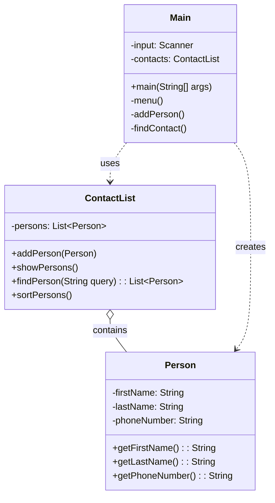

# Exercício: Lista de Contatos

Este projeto implementa um gerenciador de contatos via linha de comando. O objetivo é demonstrar o uso de Coleções (`ArrayList`), a API de Streams do Java para busca de dados, e `Comparator` para ordenação de objetos.

---

## O Desafio

O desafio é criar uma aplicação de console que permita ao usuário:

1.  Adicionar novos contatos (nome, sobrenome, telefone).
2.  Listar todos os contatos cadastrados.
3.  Buscar um contato pelo nome, sobrenome ou número de telefone.
4.  Ordenar a lista de contatos em ordem alfabética (primeiro por nome, depois por sobrenome).

---

## Estrutura do Código

O projeto é dividido em três classes, cada uma com uma responsabilidade clara, seguindo boas práticas de encapsulamento.

### 1. `Person.java`

*   **Responsabilidade:** É a classe de modelo (POJO - Plain Old Java Object) que representa um único contato. 
*   Contém os atributos `firstName`, `lastName` e `phoneNumber`, além dos seus respectivos getters. É uma classe imutável, o que é uma boa prática para objetos de dados.

### 2. `ContactList.java`

*   **Responsabilidade:** Gerencia a coleção de contatos. Contém toda a lógica de manipulação de dados.
*   **Atributos:**
    *   `persons`: Um `ArrayList` que armazena os objetos `Person`.
*   **Métodos Chave:**
    *   `findPerson(String query)`: Utiliza a **Stream API** do Java para filtrar a lista de contatos. O filtro (`filter`) mantém apenas as pessoas cujo nome, sobrenome ou telefone correspondem à busca. O resultado é coletado (`collect`) em uma nova lista.
    *   `sortPersons()`: Usa o método `sort` da lista, passando um `Comparator`. O `Comparator.comparing()` cria um comparador que ordena primeiro pelo `firstName` e, em caso de empate, o `thenComparing()` é usado para ordenar pelo `lastName`.

### 3. `Main.java`

*   **Responsabilidade:** Controla a interface com o usuário e o fluxo da aplicação.
*   Apresenta um menu de opções e, com base na escolha do usuário, chama os métodos apropriados da classe `ContactList` para executar as operações.

---

## Como Executar

Compile e execute a classe `Main.java`. A aplicação iniciará com alguns contatos pré-cadastrados. Você pode usar o menu para adicionar, listar, buscar e ordenar os contatos.

---

## Conceitos Chave

*   **Collections (`ArrayList`):** Usado como a estrutura de dados principal para armazenar a lista de contatos de forma dinâmica.
*   **Stream API:** Uma poderosa API do Java para processamento de coleções de dados de forma declarativa. O método `findPerson` é um excelente exemplo de sua aplicação para filtragem.
*   **`Comparator` e `sort`:** Utilizados para definir e aplicar uma lógica de ordenação customizada a uma lista de objetos.
*   **Encapsulamento:** A separação de responsabilidades entre a classe de dados (`Person`), a classe de lógica de negócio (`ContactList`) e a classe de apresentação (`Main`) torna o código mais organizado e fácil de manter.