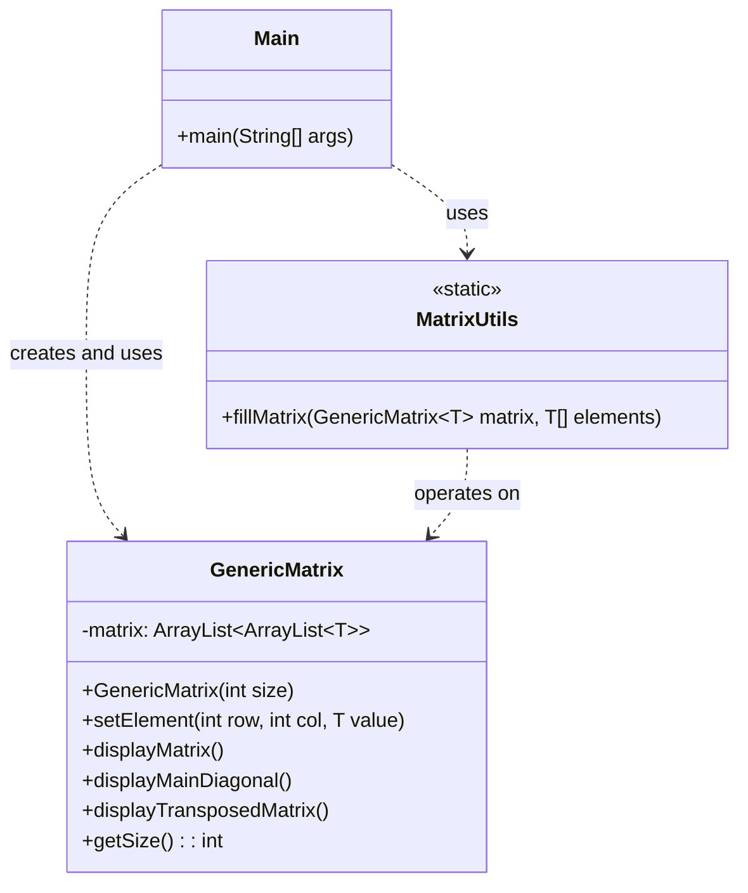

# Exercício: Matriz Genérica

Este projeto demonstra o poder do Polimorfismo Paramétrico (Generics) em Java para criar uma estrutura de dados reutilizável. O objetivo é construir uma classe `GenericMatrix` que possa representar e manipular uma matriz quadrada de qualquer tipo de dado (Integer, Character, String, etc.).

---

## O Desafio

O desafio consiste em criar uma classe de matriz que ofereça as seguintes funcionalidades:

1.  Ser **genérica**, ou seja, não estar presa a um único tipo de dado como `int[][]` ou `String[][]`.
2.  Permitir a inserção de elementos em qualquer posição.
3.  Exibir a matriz original no console.
4.  Exibir os elementos da diagonal principal.
5.  Exibir a matriz transposta (linhas viram colunas e vice-versa).

---

## Estrutura do Código

O projeto é estruturado em três classes que trabalham em conjunto para fornecer a funcionalidade da matriz genérica.

### 1. `GenericMatrix<T>`

*   **Responsabilidade:** É o coração do projeto. Define a estrutura e as operações da matriz.
*   **Generics (`<T>`):** A declaração `class GenericMatrix<T>` torna a classe genérica. `T` é um parâmetro de tipo que será substituído por um tipo real (como `Integer` ou `Character`) quando um objeto da matriz for criado.
*   **Estrutura Interna:** Em vez de usar um array nativo como `T[][]`, a classe utiliza um `ArrayList` de `ArrayLists` (`ArrayList<ArrayList<T>>`). Isso oferece mais flexibilidade do que os arrays nativos em Java quando se trabalha com generics.
*   **Métodos:** Implementa as operações de exibição da matriz, da diagonal e da transposta.

### 2. `MatrixUtils.java`

*   **Responsabilidade:** Fornece métodos utilitários estáticos para operar sobre a `GenericMatrix`.
*   **Método Genérico:** O método `fillMatrix` também é genérico (`public static <T> void...`). Ele pode receber uma `GenericMatrix` de qualquer tipo `T` e um array de elementos do mesmo tipo `T` para preenchê-la.

### 3. `Main.java`

*   **Responsabilidade:** Demonstra o uso da `GenericMatrix`.
*   Cria duas instâncias da matriz: uma `GenericMatrix<Character>` e uma `GenericMatrix<Integer>`. Isso mostra como a mesma classe pode ser reutilizada para diferentes tipos de dados sem nenhuma alteração em seu código-fonte.

---

## Como Executar

Compile e execute a classe `Main.java`. A saída no console mostrará duas seções: a primeira com a matriz de caracteres e suas operações, e a segunda com a matriz de inteiros, demonstrando a flexibilidade da classe genérica.

---

## Conceitos Chave

*   **Polimorfismo Paramétrico (Generics):** Permite que classes, interfaces e métodos operem sobre tipos como parâmetros. O principal benefício é a reutilização de código e a segurança de tipo (type safety), pois o compilador garante que você não misture tipos incompatíveis.
*   **Métodos Estáticos Genéricos:** Métodos que podem operar em diferentes tipos sem a necessidade de uma instância da classe. `MatrixUtils.fillMatrix` é um exemplo clássico.
*   **Type Erasure:** É importante notar que, em tempo de execução, o Java "apaga" as informações de tipo genérico. A validação de tipo ocorre em tempo de compilação.