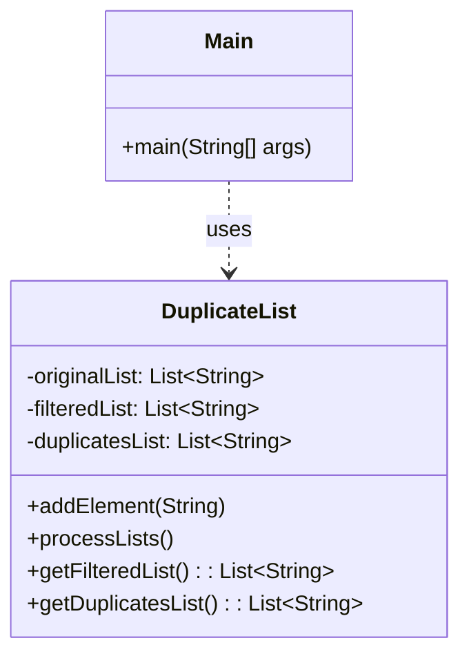

# Exercício: Implementação de Lista com Filtro de Duplicados

Este projeto demonstra uma implementação customizada para processar uma lista de strings e separá-la em duas outras listas: uma contendo os elementos únicos (sem repetição) e outra contendo apenas os elementos que apareceram de forma duplicada na lista original.

---

## O Desafio

O desafio consiste em:

1.  Receber uma lista de elementos (neste caso, strings) do usuário.
2.  Processar essa lista de entrada.
3.  Gerar uma primeira lista de saída que contenha cada elemento da lista original apenas uma vez (elementos únicos).
4.  Gerar uma segunda lista de saída que contenha apenas os elementos que eram duplicados na lista original.

Por exemplo, se a entrada for `a b c a d b`, as saídas devem ser:
*   **Lista 1 (Únicos):** `a b c d`
*   **Lista 2 (Duplicados):** `a b`

---

## Estrutura do Código

O projeto é composto por duas classes que separam a lógica de processamento da interação com o usuário.

### 1. `DuplicateList.java`

*   **Responsabilidade:** Contém a lógica central para armazenar e processar as listas.
*   **Atributos:**
    *   `originalList`: Armazena os elementos conforme são inseridos pelo usuário.
    *   `filteredList`: Armazenará a lista de elementos únicos.
    *   `duplicatesList`: Armazenará a lista de elementos duplicados.
*   **Método Chave:**
    *   `processLists()`: Itera sobre a `originalList`. Para cada elemento, ele verifica:
        1.  Se o elemento **não** está na `filteredList`, ele é adicionado. Esta é a primeira vez que o elemento é visto.
        2.  Se o elemento **já** está na `filteredList`, significa que é uma duplicata. Então, ele é adicionado à `duplicatesList` (se já não estiver lá, para evitar duplicatas na lista de duplicatas).

### 2. `Main.java`

*   **Responsabilidade:** Interage com o usuário.
*   Usa um `Scanner` para ler uma linha de entrada do usuário.
*   Usa `input.split(" ")` para separar a linha em elementos individuais.
*   Adiciona cada elemento à `DuplicateList`.
*   Chama `processLists()` para executar a lógica de separação.
*   Exibe os resultados (a lista filtrada e a lista de duplicatas).

---

## Como Executar

Compile e execute a classe `Main.java`. O programa solicitará que você insira os elementos da lista, separados por espaço. Após você pressionar Enter, ele exibirá as duas listas resultantes.

---

## Conceitos Chave

*   **Collections (`ArrayList`):** A base do projeto, usada para armazenar as listas de forma dinâmica.
*   **Lógica de Algoritmo:** O método `processLists` implementa um algoritmo simples, mas eficaz, para identificar e separar elementos únicos e duplicados em uma única passagem pela lista original.
*   **Complexidade:** É interessante notar que a complexidade deste algoritmo não é a mais otimizada. O uso repetido de `list.contains()` dentro de um loop pode levar a uma performance mais lenta (`O(n^2)`) em listas muito grandes. Uma solução mais performática poderia usar um `HashSet` para verificar a existência de elementos em tempo constante (`O(1)`), resultando em um algoritmo com complexidade `O(n)`.
