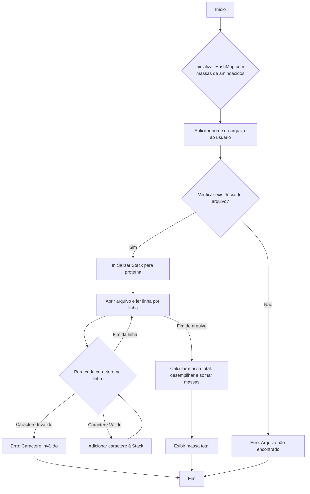

# Exercício: Cálculo da Massa Molecular de Proteínas

Este projeto em Java demonstra o uso de estruturas de dados como `HashMap` e `Stack` para calcular a massa molecular total de uma sequência de proteína lida de um arquivo. Ele também aborda conceitos de manipulação de arquivos e tratamento de exceções.

---

## O Desafio

O desafio consiste em:

1.  Armazenar as massas moleculares de diferentes aminoácidos.
2.  Ler uma sequência de proteína de um arquivo de texto fornecido pelo usuário.
3.  Validar se todos os caracteres na sequência correspondem a aminoácidos conhecidos.
4.  Calcular a massa molecular total da proteína somando as massas de seus aminoácidos constituintes.
5.  Lidar com possíveis erros, como arquivo não encontrado ou caracteres inválidos na sequência.

---

## Estrutura do Código

Todo o código está contido na classe `Main.java`.



### 1. `Main.java`

*   **`HashMap<Character, Double> aminoAcidMass`:**
    *   Armazena os aminoácidos (representados por `char`) como chaves e suas respectivas massas moleculares (`Double`) como valores.
    *   Permite uma busca eficiente da massa de um aminoácido dado seu símbolo.
*   **Leitura de Arquivo:**
    *   Usa `Scanner` para obter o nome do arquivo do usuário.
    *   Verifica se o arquivo existe antes de tentar lê-lo.
    *   Utiliza `BufferedReader` e `FileReader` para ler o conteúdo do arquivo linha por linha, o que é eficiente para arquivos grandes.
*   **`Stack<Character> proteinStack`:**
    *   Uma pilha é usada para armazenar os aminoácidos lidos do arquivo. Embora uma `List` também pudesse ser usada, a `Stack` é uma escolha válida para processar elementos em ordem LIFO (Last-In, First-Out), embora a ordem de soma não afete o resultado final neste caso.
*   **Validação e Cálculo:**
    *   Cada caractere lido do arquivo é validado contra o `aminoAcidMass` `HashMap`. Se um caractere desconhecido for encontrado, o programa exibe um erro e encerra.
    *   Após ler toda a sequência, a massa total é calculada desempilhando cada aminoácido da `proteinStack` e somando suas massas correspondentes.
*   **Tratamento de Exceções:**
    *   Um bloco `try-catch` é usado para lidar com `IOException` que pode ocorrer durante a leitura do arquivo, garantindo que o programa não trave inesperadamente.

---

## Como Executar

1.  **Crie um arquivo de texto:** Antes de executar, crie um arquivo de texto (por exemplo, `protein.txt`) no mesmo diretório do seu projeto ou forneça o caminho completo. Este arquivo deve conter a sequência da proteína, por exemplo:
    ```
    AGCTY
    ```
    (Certifique-se de que os caracteres correspondem aos aminoácidos definidos no `HashMap`.)

2.  **Compile e execute:** Compile e execute a classe `Main.java`. O programa solicitará o nome do arquivo.

    ```bash
    java Main
    ```

3.  **Insira o nome do arquivo:** Quando solicitado, digite o nome do arquivo (ex: `protein.txt`) e pressione Enter.

    ```
    Digite o nome do arquivo contendo a sequência da proteína: protein.txt
    ```

O programa então calculará e exibirá a massa total da proteína.

---

## Conceitos Chave

*   **`HashMap`:** Uma estrutura de dados que armazena pares chave-valor, ideal para mapear aminoácidos às suas massas para busca rápida.
*   **`Stack`:** Uma estrutura de dados LIFO (Last-In, First-Out), útil para processar elementos em uma ordem específica.
*   **Manipulação de Arquivos (File I/O):** Demonstra como ler dados de arquivos de texto usando `FileReader` e `BufferedReader`.
*   **Tratamento de Exceções:** Uso de `try-catch` para gerenciar erros de forma robusta, como `IOException`.