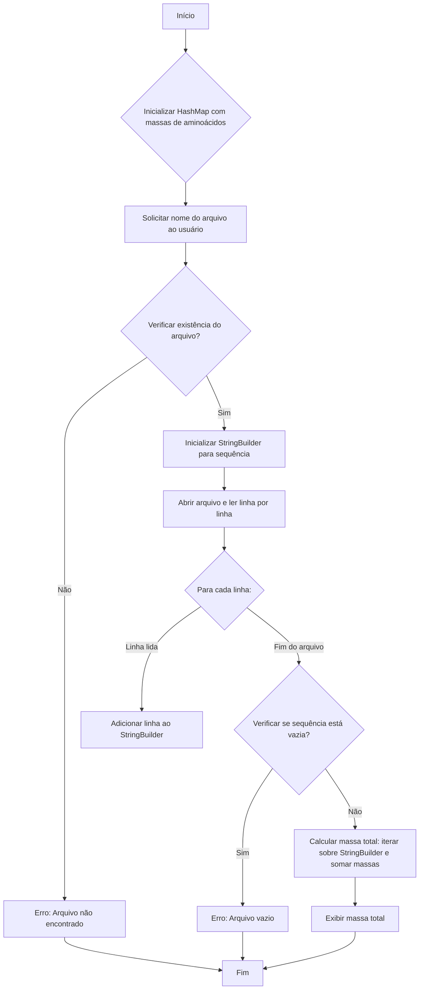

# Exercício: Cálculo da Massa Molecular de Proteínas (Abordagem Alternativa)

Este projeto em Java demonstra uma abordagem alternativa para calcular a massa molecular total de uma sequência de proteína lida de um arquivo. Ele utiliza um `HashMap` para armazenar as massas dos aminoácidos e um `StringBuilder` para construir a sequência completa da proteína antes de realizar o cálculo.

---

## O Desafio

O desafio é o mesmo do exercício anterior (`activity-2`):

1.  Armazenar as massas moleculares de diferentes aminoácidos.
2.  Ler uma sequência de proteína de um arquivo de texto fornecido pelo usuário.
3.  Validar se todos os caracteres na sequência correspondem a aminoácidos conhecidos.
4.  Calcular a massa molecular total da proteína somando as massas de seus aminoácidos constituintes.
5.  Lidar com possíveis erros, como arquivo não encontrado ou caracteres inválidos na sequência.

A principal diferença aqui é a forma como a sequência é processada antes do cálculo.

---

## Estrutura do Código

Todo o código está contido na classe `Main.java`.



### 1. `Main.java`

*   **`HashMap<Character, Double> aminoAcidMass`:**
    *   Armazena os aminoácidos (representados por `char`) como chaves e suas respectivas massas moleculares (`Double`) como valores, permitindo uma busca eficiente.
*   **Leitura de Arquivo:**
    *   Usa `Scanner` para obter o nome do arquivo do usuário.
    *   Verifica a existência do arquivo.
    *   Utiliza `BufferedReader` e `FileReader` para ler o conteúdo do arquivo linha por linha.
*   **`StringBuilder proteinSequence`:**
    *   **Diferença Chave:** Ao contrário do exercício anterior que usava uma `Stack`, este projeto concatena todas as linhas do arquivo em um único `StringBuilder`. Isso cria uma representação completa da sequência da proteína em memória antes de qualquer processamento de massa.
*   **Validação e Cálculo:**
    *   Após a leitura completa do arquivo, o programa itera sobre os caracteres do `proteinSequence` `StringBuilder`.
    *   Cada caractere é validado contra o `aminoAcidMass` `HashMap`. Se um caractere desconhecido for encontrado, o programa exibe um erro e encerra.
    *   A massa total é calculada somando as massas dos aminoácidos.
*   **Tratamento de Exceções:**
    *   Um bloco `try-catch` é usado para lidar com `IOException` durante a leitura do arquivo.

---

## Como Executar

1.  **Crie um arquivo de texto:** Crie um arquivo de texto (por exemplo, `protein_sequence.txt`) no mesmo diretório do seu projeto ou forneça o caminho completo. Este arquivo deve conter a sequência da proteína, por exemplo:
    ```
    AGCTY
    ```
    (Certifique-se de que os caracteres correspondem aos aminoácidos definidos no `HashMap`.)

2.  **Compile e execute:** Compile e execute a classe `Main.java`. O programa solicitará o nome do arquivo.

    ```bash
    java Main
    ```

3.  **Insira o nome do arquivo:** Quando solicitado, digite o nome do arquivo (ex: `protein_sequence.txt`) e pressione Enter.

    ```
    Digite o nome do arquivo contendo a sequência da proteína: protein_sequence.txt
    ```

O programa então calculará e exibirá a massa total da proteína.

---

## Conceitos Chave

*   **`HashMap`:** Uma estrutura de dados eficiente para mapear aminoácidos às suas massas.
*   **`StringBuilder`:** Uma classe mutável para construir e manipular sequências de caracteres de forma eficiente, especialmente quando muitas concatenações são necessárias.
*   **Manipulação de Arquivos (File I/O):** Demonstra como ler dados de arquivos de texto.
*   **Tratamento de Exceções:** Uso de `try-catch` para gerenciar erros de forma robusta.
*   **Comparação de Abordagens:** Este projeto, em comparação com o `activity-2`, ilustra diferentes maneiras de processar dados de entrada, cada uma com suas próprias implicações em termos de uso de memória e complexidade de código.
