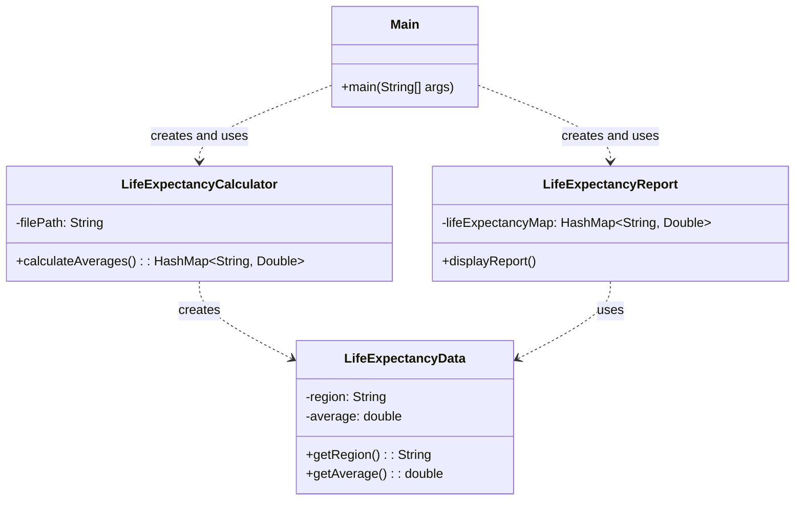

# Exercício: Expectativa de Vida Média no Brasil

Este projeto em Java demonstra como processar dados de um arquivo CSV para calcular a expectativa de vida média por região e gerar um relatório formatado no console. Ele aborda conceitos de manipulação de arquivos, processamento de dados e formatação de saída.

---

## O Desafio

O desafio consiste em:

1.  Ler dados de expectativa de vida de um arquivo CSV.
2.  Calcular a expectativa de vida média para cada região presente no arquivo.
3.  Gerar um relatório visualmente agradável no console, exibindo as médias calculadas para cada região.

---

## Estrutura do Código

O projeto é bem modularizado, com classes dedicadas a diferentes responsabilidades.



### 1. `LifeExpectancyData.java`

*   **Responsabilidade:** É uma classe simples (POJO) que representa uma entrada de dados de expectativa de vida, contendo o nome da região e sua média.

### 2. `LifeExpectancyCalculator.java`

*   **Responsabilidade:** Lê o arquivo CSV e calcula as médias de expectativa de vida por região.
*   **Método `calculateAverages()`:**
    *   Abre o arquivo CSV usando `BufferedReader` e `FileReader`.
    *   Lê cada linha, divide os dados usando o delimitador `;`.
    *   Calcula a média para cada região e armazena os resultados em um `HashMap<String, Double>`, onde a chave é o nome da região e o valor é a média.
    *   Inclui tratamento básico de `IOException`.

### 3. `LifeExpectancyReport.java`

*   **Responsabilidade:** Formata e exibe o relatório final no console.
*   **Formatação:** Utiliza códigos ANSI para adicionar cores e bordas ao relatório, tornando-o mais legível e visualmente atraente.
*   **Método `displayReport()`:** Itera sobre o `HashMap` de expectativas de vida e imprime cada região e sua média em um formato tabular.

### 4. `Main.java`

*   **Responsabilidade:** É o ponto de entrada da aplicação. Orquestra a execução, criando instâncias do `LifeExpectancyCalculator` e do `LifeExpectancyReport`.
*   Define o caminho para o arquivo CSV (`src/main/resources/research.csv`).

---

## Como Executar

1.  **Crie o arquivo CSV:** Certifique-se de que o arquivo `research.csv` exista no diretório `src/main/resources/` do seu projeto. O formato esperado é:
    ```csv
    Regiao;Ano1;Ano2;Ano3;...
    Norte;70.5;71.2;72.0
    Nordeste;68.9;69.5;70.1
    Sudeste;74.1;74.5;75.0
    Sul;75.0;75.3;75.8
    Centro-Oeste;72.3;72.8;73.5
    ```
    A primeira linha é o cabeçalho e será ignorada. As linhas seguintes devem ter o nome da região seguido por valores numéricos separados por ponto e vírgula.

2.  **Compile e execute:** Compile e execute a classe `Main.java`.

    ```bash
    java Main
    ```

O programa lerá os dados, calculará as médias e exibirá o relatório formatado no console.

---

## Conceitos Chave

*   **Manipulação de Arquivos (File I/O):** Leitura de dados de arquivos CSV.
*   **`HashMap`:** Utilizado para armazenar e acessar eficientemente as expectativas de vida médias por região.
*   **Processamento de Dados:** Lógica para calcular médias a partir de dados tabulares.
*   **Formatação de Saída:** Uso de `System.out.printf` e códigos ANSI para criar um relatório visualmente atraente no console.
*   **Modularização:** O projeto é dividido em classes com responsabilidades claras, o que facilita a manutenção e o entendimento.
