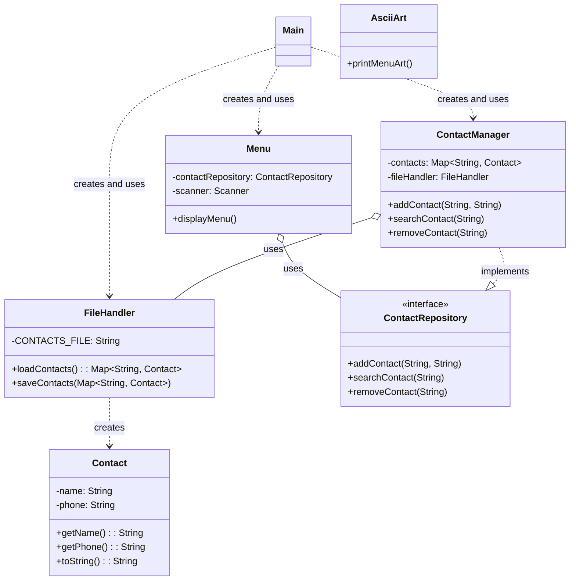

# Exercício: Gerenciador de Contatos com Persistência em Arquivo

Este projeto implementa um gerenciador de contatos mais robusto, com a capacidade de persistir os dados em um arquivo de texto. Ele demonstra conceitos importantes como separação de responsabilidades, interfaces para contratos de serviço, e manipulação de arquivos para armazenamento de dados.

---

## O Desafio

O desafio é criar uma aplicação de console que permita ao usuário:

1.  Adicionar novos contatos (nome e telefone).
2.  Buscar um contato pelo nome.
3.  Remover um contato pelo nome.
4.  **Persistir os contatos em um arquivo**, de modo que os dados não sejam perdidos ao fechar o programa.

---

## Estrutura do Código

O projeto é bem modularizado, com cada classe tendo uma responsabilidade específica, o que facilita a manutenção e a escalabilidade.



### 1. `Contact.java`

*   **Responsabilidade:** Representa um único contato com nome e telefone. É uma classe de dados simples.

### 2. `ContactRepository.java` (Interface)

*   **Responsabilidade:** Define o contrato para qualquer classe que queira atuar como um repositório de contatos. Isso promove o **baixo acoplamento**, pois o `Menu` interage apenas com a interface, não com a implementação concreta.

### 3. `ContactManager.java`

*   **Responsabilidade:** Implementa a lógica de negócio para gerenciar os contatos (adicionar, buscar, remover).
*   Implementa a interface `ContactRepository`.
*   Utiliza um `Map<String, Contact>` para armazenar os contatos em memória, usando o nome como chave para busca rápida.
*   **Depende de `FileHandler`** para carregar e salvar os contatos, demonstrando **composição** ou **agregação** (dependendo de como `FileHandler` é instanciado, aqui é injetado no construtor).

### 4. `FileHandler.java`

*   **Responsabilidade:** Lida com a leitura e escrita dos contatos no arquivo `contacts.txt`.
*   **Métodos:**
    *   `loadContacts()`: Lê o arquivo e popula um `HashMap` com os contatos.
    *   `saveContacts()`: Escreve os contatos do `HashMap` de volta para o arquivo.
*   Inclui tratamento básico de `IOException`.

### 5. `Menu.java`

*   **Responsabilidade:** Gerencia a interface do usuário, exibindo o menu e processando as entradas.
*   Interage com o `ContactRepository` (via interface) para realizar as operações de contato.

### 6. `AsciiArt.java`

*   **Responsabilidade:** Contém um método estático para imprimir uma arte ASCII no console, usada para estilizar o menu.

### 7. `Main.java`

*   **Responsabilidade:** Ponto de entrada da aplicação. Orquestra a criação e conexão de todas as partes do sistema.

---

## Como Executar

1.  **Compile e execute:** Compile e execute a classe `Main.java`.

    ```bash
    java Main
    ```

2.  **Interaja com o menu:** Um menu será exibido no console. Você pode:
    *   Adicionar contatos (eles serão salvos no arquivo `src/main/resources/contacts.txt`).
    *   Buscar contatos.
    *   Remover contatos.
    *   Sair do programa. Ao sair, os contatos adicionados/removidos serão persistidos.

3.  **Verifique o arquivo:** Após adicionar alguns contatos e sair, você pode abrir o arquivo `src/main/resources/contacts.txt` para ver os dados salvos.

---

## Conceitos Chave

*   **Persistência de Dados:** Armazenamento de dados em um arquivo para que não sejam perdidos após o encerramento do programa.
*   **Separação de Responsabilidades (SRP):** Cada classe tem uma única responsabilidade bem definida (ex: `FileHandler` só lida com arquivos, `ContactManager` só com a lógica de negócio).
*   **Interfaces:** Definem contratos e promovem o baixo acoplamento, permitindo que diferentes implementações sejam "plugadas" sem alterar o código que as utiliza.
*   **Manipulação de Arquivos (File I/O):** Leitura e escrita de dados em arquivos de texto.
*   **`HashMap`:** Usado para armazenar contatos em memória para acesso rápido.
