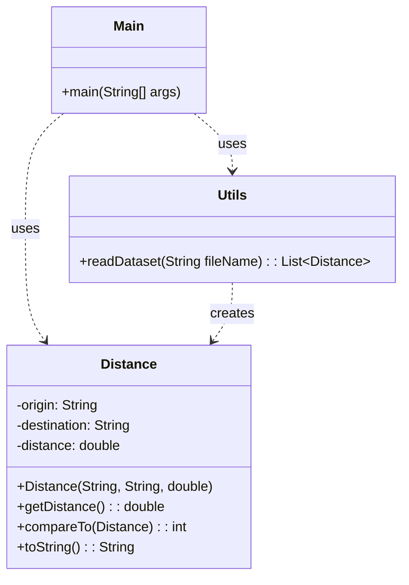

# Exercício: Processamento de Distâncias com Java Stream API

Este projeto demonstra o poder e a flexibilidade da Java Stream API para processar e manipular coleções de dados. Ele lê informações de distância entre cidades de um arquivo CSV e permite diferentes formas de visualização e ordenação desses dados.

---

## O Desafio

O desafio consiste em:

1.  Ler um conjunto de dados de distâncias (origem, destino, distância) de um arquivo CSV.
2.  Permitir que o usuário escolha diferentes formas de exibir esses dados:
    *   Simples: Listar todas as distâncias.
    *   Filtrado: Listar as cinco primeiras distâncias ímpares.
    *   Ordenado: Listar todas as distâncias em ordem crescente.
    *   Ordenado (apenas valores): Listar apenas os valores das distâncias em ordem decrescente.

---

## Estrutura do Código

O projeto é dividido em três classes, cada uma com uma responsabilidade clara.



### 1. `Distance.java`

*   **Responsabilidade:** Representa uma distância entre dois pontos.
*   Implementa a interface `Comparable<Distance>`, o que permite que objetos `Distance` sejam ordenados naturalmente com base em sua propriedade `distance`.
*   Sobrescreve `equals()` e `hashCode()` para garantir que objetos `Distance` possam ser comparados corretamente em coleções.

### 2. `Utils.java`

*   **Responsabilidade:** Contém um método estático para ler o arquivo CSV e parsear os dados em uma `List<Distance>`.
*   **`readDataset(String fileName)`:** Abre o arquivo, lê linha por linha, divide os dados por vírgula e cria objetos `Distance`.

### 3. `Main.java`

*   **Responsabilidade:** É o ponto de entrada da aplicação. Gerencia a interação com o usuário e demonstra o uso da Stream API.
*   **Uso da Stream API:**
    *   **`distances.forEach(System.out::println)`:** Exibe cada elemento da lista.
    *   **`filter(d -> d.getDistance() % 2 != 0)`:** Filtra as distâncias para incluir apenas as ímpares.
    *   **`limit(5)`:** Limita o resultado aos primeiros 5 elementos.
    *   **`sorted()`:** Ordena a stream usando a ordem natural definida por `Comparable` em `Distance`.
    *   **`sorted((d1, d2) -> Double.compare(d2.getDistance(), d1.getDistance()))`:** Ordena em ordem decrescente usando um `Comparator` customizado (lambda expression).
    *   **`map(Distance::getDistance)`:** Transforma a stream de objetos `Distance` em uma stream de `Double` (apenas os valores das distâncias).

---

## Como Executar

1.  **Crie o arquivo CSV:** Certifique-se de que o arquivo `cidades.csv` exista no diretório `src/main/resources/` do seu projeto. O formato esperado é:
    ```csv
    Origem,Destino,Distancia
    Sao Paulo,Rio de Janeiro,429.0
    Rio de Janeiro,Belo Horizonte,442.0
    Sao Paulo,Belo Horizonte,586.0
    Curitiba,Porto Alegre,709.0
    Salvador,Recife,839.0
    ```
    Cada linha deve conter origem, destino e distância, separados por vírgulas.

2.  **Compile e execute:** Compile e execute a classe `Main.java`.

    ```bash
    java Main
    ```

3.  **Escolha uma opção:** O programa solicitará que você escolha uma opção de exibição (1 a 4). Digite o número e pressione Enter para ver o resultado.

---

## Conceitos Chave

*   **Java Stream API:** Uma API poderosa para processar coleções de dados de forma funcional e declarativa, permitindo operações como `filter`, `map`, `sorted` e `forEach`.
*   **`Comparable` e `Comparator`:** Interfaces usadas para definir a ordem de objetos. `Comparable` define a ordem natural, enquanto `Comparator` permite ordens alternativas.
*   **Expressões Lambda:** Usadas para criar `Comparator`s de forma concisa.
*   **Manipulação de Arquivos:** Leitura de dados de arquivos CSV.
