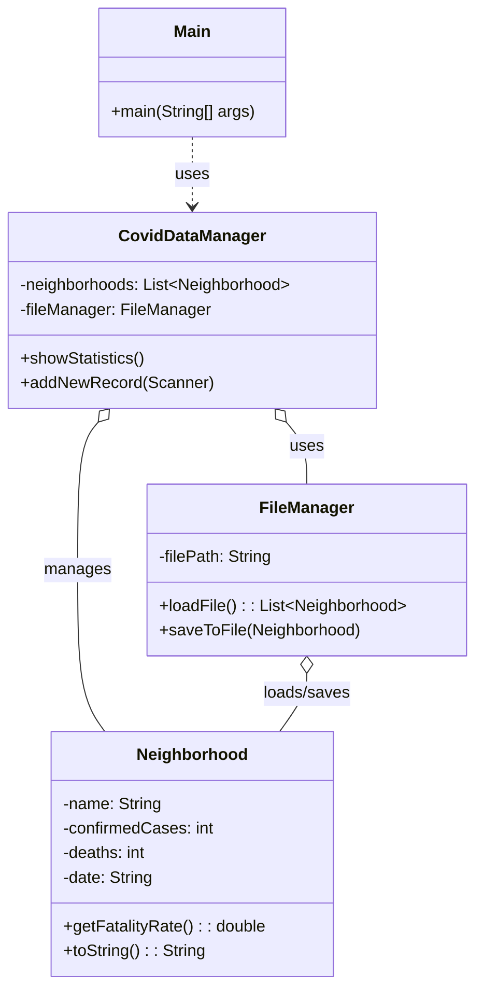

# Exercício: Análise de Dados COVID-19 por Bairro

Este projeto implementa um sistema simples para gerenciar e analisar dados de COVID-19 por bairro. Ele demonstra como ler e escrever dados em arquivos, calcular métricas (como taxa de fatalidade) e apresentar estatísticas, utilizando conceitos de Programação Orientada a Objetos e manipulação de arquivos.

---

## O Desafio

O desafio consiste em:

1.  Carregar dados de COVID-19 (nome do bairro, casos confirmados, mortes, data) de um arquivo CSV.
2.  Permitir que o usuário adicione novos registros de dados.
3.  Calcular a taxa de fatalidade para cada bairro.
4.  Exibir estatísticas, como o bairro com a maior taxa de fatalidade.
5.  Persistir os dados em um arquivo para que não sejam perdidos entre as execuções do programa.

---

## Estrutura do Código

O projeto é bem modularizado, com classes dedicadas a diferentes responsabilidades.



### 1. `Neighborhood.java`

*   **Responsabilidade:** Representa um registro de dados de COVID-19 para um bairro específico.
*   Contém atributos como nome, casos confirmados, mortes e data.
*   Possui um método `getFatalityRate()` que calcula a taxa de fatalidade (mortes / casos confirmados).

### 2. `FileManager.java`

*   **Responsabilidade:** Lida com as operações de leitura e escrita de dados no arquivo `covid_data.csv`.
*   **Métodos:**
    *   `loadFile()`: Lê o arquivo CSV e parseia cada linha em um objeto `Neighborhood`, retornando uma lista.
    *   `saveToFile(Neighborhood)`: Adiciona um novo registro de bairro ao arquivo. Note que esta implementação apenas adiciona o nome e a taxa de fatalidade ao arquivo, o que pode ser uma simplificação para o exercício.
*   Inclui tratamento de `IOException`.

### 3. `CovidDataManager.java`

*   **Responsabilidade:** Gerencia a coleção de objetos `Neighborhood` e as operações de análise.
*   **Métodos:**
    *   `showStatistics()`: Encontra e exibe o bairro com a maior taxa de fatalidade usando `Collections.max()` e um `Comparator`.
    *   `addNewRecord(Scanner)`: Solicita ao usuário os dados para um novo registro de bairro, cria um objeto `Neighborhood` e o adiciona à lista e ao arquivo.

### 4. `Main.java`

*   **Responsabilidade:** É o ponto de entrada da aplicação. Apresenta um menu interativo para o usuário.
*   Cria uma instância de `CovidDataManager` e um `Scanner` para interagir com o usuário.
*   O loop do menu permite que o usuário escolha entre ver estatísticas, adicionar um novo registro ou sair.

---

## Como Executar

1.  **Crie o arquivo CSV:** Certifique-se de que o arquivo `covid_data.csv` exista no diretório `src/main/resources/` do seu projeto. Ele pode estar vazio ou conter dados no formato:
    ```csv
    BairroA,100,5,2023-01-01
    BairroB,200,10,2023-01-01
    ```
    (Nome do bairro, casos confirmados, mortes, data - separados por vírgulas).

2.  **Compile e execute:** Compile e execute a classe `Main.java`.

    ```bash
    java Main
    ```

3.  **Interaja com o menu:** Você pode adicionar novos registros e, em seguida, ver as estatísticas atualizadas. Os dados serão salvos no arquivo `covid_data.csv`.

---

## Conceitos Chave

*   **Manipulação de Arquivos (File I/O):** Leitura e escrita de dados em arquivos CSV para persistência.
*   **Coleções (`List`):** Usada para armazenar os objetos `Neighborhood` em memória.
*   **`Comparator`:** Utilizado para definir a lógica de comparação para encontrar o bairro com a maior taxa de fatalidade.
*   **Separação de Responsabilidades:** O projeto é bem dividido em classes com responsabilidades claras (gerenciamento de dados, manipulação de arquivos, interface do usuário).
