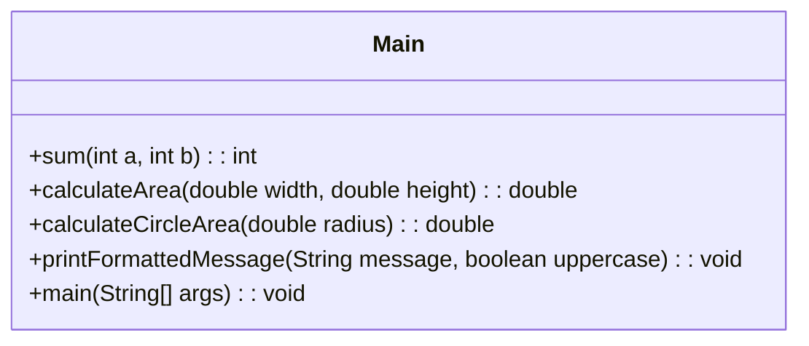

# Exercício: Princípios de Desenvolvimento de Software (KISS, DRY, YAGNI)

Este projeto é uma demonstração prática de três princípios fundamentais no desenvolvimento de software: KISS (Keep It Simple, Stupid), DRY (Don't Repeat Yourself) e YAGNI (You Ain't Gonna Need It). O objetivo é ilustrar como esses princípios podem ser aplicados no código para torná-lo mais limpo, eficiente e fácil de manter.

---

## O Desafio

O desafio não é resolver um problema específico, mas sim aplicar e exemplificar os princípios de codificação em funções simples.

---

## Estrutura do Código

Todo o código está contido na classe `Main.java`, com métodos estáticos que demonstram cada princípio.



### 1. `Main.java`

#### a) Princípio KISS (Keep It Simple, Stupid)

*   **Exemplo:** Método `sum(int a, int b)`.
*   **Conceito:** O código deve ser o mais simples e direto possível, evitando complexidade desnecessária. A função `sum` faz exatamente o que o nome sugere: soma dois números. Adiciona uma validação básica para números negativos, tornando-a robusta sem complicar a lógica central.

#### b) Princípio DRY (Don't Repeat Yourself)

*   **Exemplo:** Métodos `calculateArea(double width, double height)` e `calculateCircleArea(double radius)`.
*   **Conceito:** Evitar a duplicação de código. Embora os exemplos aqui sejam de cálculos de área diferentes, a ideia é que, se houvesse lógica comum (por exemplo, validação de dimensões positivas para todas as formas), essa lógica seria encapsulada em um único lugar. No exemplo, a validação de entrada é repetida, mas o princípio DRY se aplica mais amplamente à reutilização de componentes ou abstrações para evitar reescrever a mesma lógica várias vezes.

#### c) Princípio YAGNI (You Ain't Gonna Need It)

*   **Exemplo:** Método `printFormattedMessage(String message, boolean uppercase)`.
*   **Conceito:** Não adicionar funcionalidades que não são estritamente necessárias no momento. O método `printFormattedMessage` formata e imprime uma mensagem. Ele não inclui funcionalidades extras (como salvar em arquivo, enviar por email, etc.) que não foram solicitadas, focando apenas no propósito imediato.

---

## Como Executar

Compile e execute a classe `Main.java`. A saída no console mostrará os resultados das operações, demonstrando a aplicação de cada princípio.

```bash
java Main
```

---

## Conceitos Chave

*   **KISS (Keep It Simple, Stupid):** Prioriza a simplicidade e a clareza do código.
*   **DRY (Don't Repeat Yourself):** Promove a reutilização de código e a eliminação de duplicação.
*   **YAGNI (You Ain't Gonna Need It):** Evita a implementação de funcionalidades desnecessárias ou especulativas.
*   **Tratamento de Exceções:** Uso de `IllegalArgumentException` para lidar com entradas inválidas, tornando as funções mais seguras.
