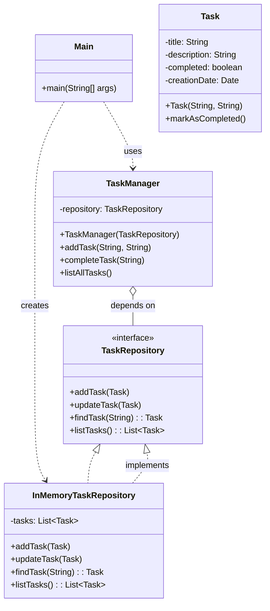

# Exercício: Princípios SOLID em um Gerenciador de Tarefas

Este projeto é uma demonstração prática dos princípios SOLID (Single Responsibility Principle, Open/Closed Principle, Liskov Substitution Principle, Dependency Inversion Principle) aplicados a um sistema simples de gerenciamento de tarefas. O objetivo é ilustrar como esses princípios podem ser usados para criar um código mais modular, flexível, testável e fácil de manter.

---

## O Desafio

O desafio é construir um sistema de gerenciamento de tarefas que permita:

1.  Adicionar novas tarefas.
2.  Marcar tarefas como concluídas.
3.  Listar todas as tarefas.

O foco principal não é a funcionalidade em si, mas como a arquitetura do código adere aos princípios SOLID.

---

## Estrutura do Código

O projeto é dividido em várias classes e uma interface, cada uma com uma responsabilidade bem definida, refletindo os princípios SOLID.



### 1. `Task.java` (Single Responsibility Principle - SRP)

*   **Conceito:** Uma classe deve ter apenas uma razão para mudar.
*   **Aplicação:** A classe `Task` é responsável **apenas** por armazenar e gerenciar as informações de uma tarefa (título, descrição, status de conclusão, data de criação). Ela não se preocupa em como as tarefas são salvas ou exibidas, apenas com seus próprios dados e estado.

### 2. `TaskRepository.java` (Open/Closed Principle - OCP e Liskov Substitution Principle - LSP)

*   **Conceito OCP:** Entidades de software (classes, módulos, funções, etc.) devem ser abertas para extensão, mas fechadas para modificação.
*   **Conceito LSP:** Objetos em um programa devem ser substituíveis por instâncias de seus subtipos sem alterar a correção do programa.
*   **Aplicação:** `TaskRepository` é uma **interface**. Ela define um contrato para operações de persistência de tarefas (adicionar, atualizar, encontrar, listar). Isso significa que:
    *   **OCP:** Podemos adicionar novas implementações de repositório (ex: `DatabaseTaskRepository`, `FileTaskRepository`) sem modificar o `TaskManager` (que usa a interface `TaskRepository`).
    *   **LSP:** Qualquer classe que implemente `TaskRepository` pode ser usada onde um `TaskRepository` é esperado, e o programa continuará funcionando corretamente.

### 3. `InMemoryTaskRepository.java` (Implementação de `TaskRepository`)

*   **Conceito:** Uma implementação concreta da interface `TaskRepository`.
*   **Aplicação:** Esta classe armazena as tarefas em uma `List` na memória. Ela adere ao OCP porque o `TaskManager` não precisa saber os detalhes de sua implementação; ele apenas interage com ela através da interface `TaskRepository`.

### 4. `TaskManager.java` (Dependency Inversion Principle - DIP)

*   **Conceito:** Módulos de alto nível não devem depender de módulos de baixo nível. Ambos devem depender de abstrações. Abstrações não devem depender de detalhes. Detalhes devem depender de abstrações.
*   **Aplicação:** A classe `TaskManager` (módulo de alto nível, lógica de negócio) não depende da implementação concreta `InMemoryTaskRepository` (módulo de baixo nível). Em vez disso, ela depende da abstração `TaskRepository` (a interface). O repositório é **injetado** no construtor do `TaskManager`, permitindo que diferentes implementações de repositório sejam usadas sem alterar o `TaskManager`.

### 5. `Main.java`

*   **Responsabilidade:** Ponto de entrada da aplicação. Orquestra a criação das instâncias e demonstra o uso do sistema de tarefas.

---

## Como Executar

Compile e execute a classe `Main.java`. A saída no console mostrará as tarefas sendo adicionadas, listadas e uma tarefa sendo marcada como concluída, demonstrando a interação entre os componentes que seguem os princípios SOLID.

```bash
java Main
```

---

## Conceitos Chave

*   **SOLID:** Um acrônimo para cinco princípios de design de software que visam tornar os designs de software mais compreensíveis, flexíveis e sustentáveis.
    *   **SRP (Single Responsibility Principle):** Uma classe, uma responsabilidade.
    *   **OCP (Open/Closed Principle):** Aberto para extensão, fechado para modificação.
    *   **LSP (Liskov Substitution Principle):** Subtipos devem ser substituíveis por seus tipos base.
    *   **DIP (Dependency Inversion Principle):** Depender de abstrações, não de implementações concretas.
*   **Injeção de Dependência:** Um padrão de design onde as dependências de um objeto são fornecidas a ele em vez de serem criadas pelo próprio objeto.
*   **Interfaces:** Essenciais para definir abstrações e permitir a aplicação dos princípios OCP, LSP e DIP.
