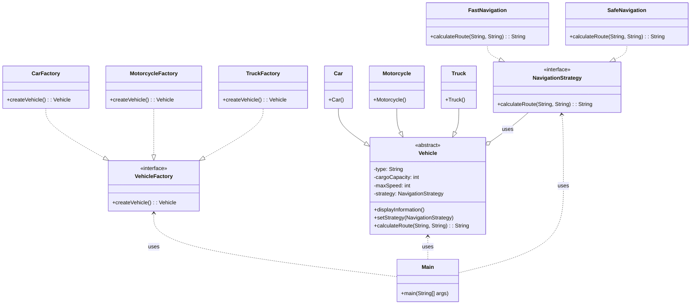

# Exercício: Padrões de Projeto - Factory Method e Strategy

Este projeto demonstra a aplicação de dois padrões de projeto fundamentais em Java: o **Factory Method** (Criacional) e o **Strategy** (Comportamental). O objetivo é criar um sistema flexível para a criação de diferentes tipos de veículos e a aplicação de diversas estratégias de navegação a esses veículos.

---

## O Desafio

O desafio consiste em:

1.  **Criar diferentes tipos de veículos** (Caminhão, Carro, Moto) de forma desacoplada, sem que o código cliente precise saber os detalhes de como cada veículo é instanciado.
2.  **Aplicar diferentes estratégias de navegação** (Navegação Rápida, Navegação Segura) a esses veículos, permitindo que a lógica de cálculo de rota seja facilmente trocada em tempo de execução.

---

## Estrutura do Código

O projeto é organizado em pacotes que refletem os padrões de design utilizados.



### 1. Padrão Factory Method

*   **Objetivo:** Definir uma interface para criar um objeto, mas deixar as subclasses decidirem qual classe instanciar. O Factory Method permite que uma classe adie a instanciação para suas subclasses.
*   **Componentes:**
    *   **`Vehicle` (Produto Abstrato):** Classe abstrata que define a interface comum para todos os objetos que serão criados (Caminhão, Carro, Moto).
    *   **`VehicleFactory` (Criador Abstrato):** Interface que declara o método `createVehicle()`, que retorna um objeto do tipo `Vehicle`.
    *   **`CarFactory`, `MotorcycleFactory`, `TruckFactory` (Criadores Concretos):** Implementam a interface `VehicleFactory` e sobrescrevem o método `createVehicle()` para retornar instâncias específicas de `Car`, `Motorcycle` e `Truck`, respectivamente.
    *   **`Car`, `Motorcycle`, `Truck` (Produtos Concretos):** As implementações concretas dos veículos.
*   **Benefício:** O código cliente (`Main`) interage apenas com a interface `VehicleFactory`, sem precisar saber qual fábrica concreta está sendo usada ou como os veículos são criados. Isso torna o sistema mais flexível e fácil de estender com novos tipos de veículos.

### 2. Padrão Strategy

*   **Objetivo:** Definir uma família de algoritmos, encapsular cada um deles e torná-los intercambiáveis. O Strategy permite que o algoritmo varie independentemente dos clientes que o utilizam.
*   **Componentes:**
    *   **`NavigationStrategy` (Interface Strategy):** Define a interface comum para todas as estratégias de navegação (`calculateRoute()`).
    *   **`FastNavigation`, `SafeNavigation` (Estratégias Concretas):** Implementam a interface `NavigationStrategy` e fornecem diferentes algoritmos para calcular a rota (rápida ou segura).
    *   **`Vehicle` (Contexto):** A classe `Vehicle` mantém uma referência para um objeto `NavigationStrategy`. Ela delega a execução do cálculo da rota para o objeto `strategy` configurado.
*   **Benefício:** A lógica de navegação é separada da classe `Vehicle`. Isso permite que novas estratégias de navegação sejam adicionadas sem modificar a classe `Vehicle`, e que a estratégia de um veículo seja alterada dinamicamente em tempo de execução.

### 3. `Main.java`

*   **Responsabilidade:** Ponto de entrada da aplicação. Demonstra a criação de veículos usando o Factory Method e a aplicação de diferentes estratégias de navegação a esses veículos.

---

## Como Executar

Compile e execute a classe `Main.java`. A saída no console mostrará as informações de cada veículo criado e as rotas calculadas com base nas estratégias de navegação atribuídas.

```bash
java Main
```

---

## Conceitos Chave

*   **Padrões de Projeto:** Soluções reutilizáveis para problemas comuns de design de software.
*   **Factory Method:** Padrão criacional que promove o desacoplamento na criação de objetos.
*   **Strategy:** Padrão comportamental que permite a troca de algoritmos em tempo de execução.
*   **Polimorfismo:** Essencial para ambos os padrões, permitindo que objetos de diferentes tipos sejam tratados de forma uniforme através de interfaces ou classes abstratas.
*   **Composição vs. Herança:** O padrão Strategy é um exemplo de como a composição (um `Vehicle` "tem uma" `NavigationStrategy`) é preferível à herança para flexibilidade de comportamento.
